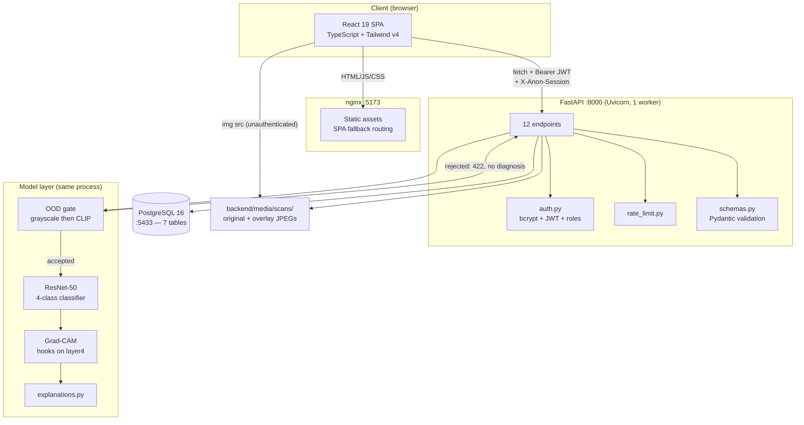
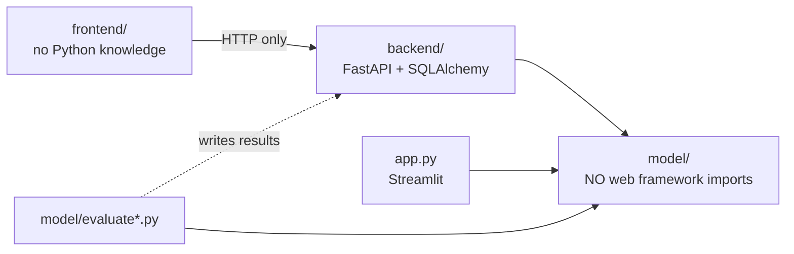
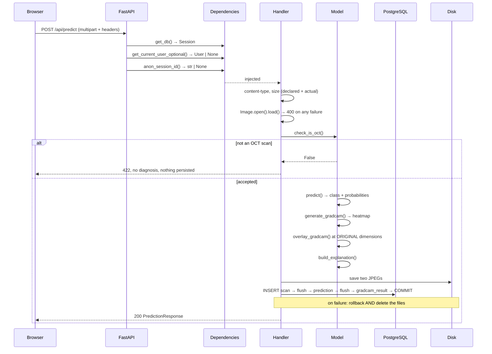
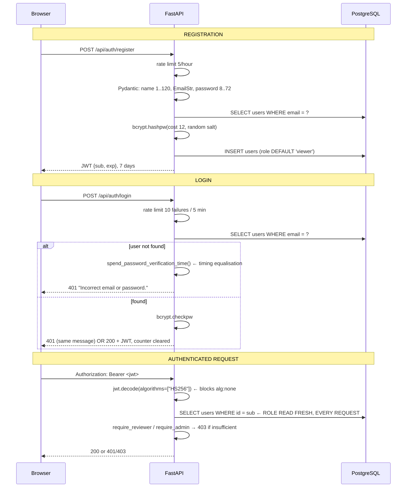
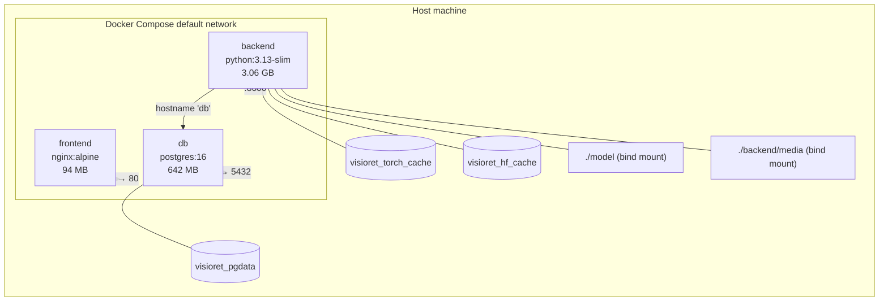
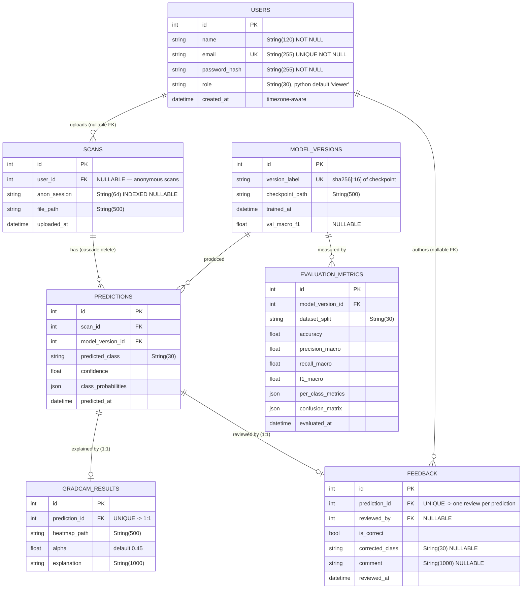
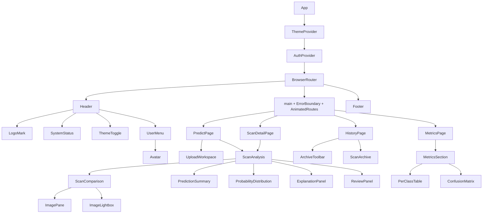

# FUTURE REPORT & PRESENTATION BLUEPRINT — Visioret

> **What this file is.** A knowledge handoff. It preserves everything a future
> AI needs to know about *this specific project* in order to produce an
> academic report and presentation later, once the official university
> requirements arrive.
>
> **What this file is NOT.** It is not the final report. It is not the final
> presentation. It does not assume any report structure, chapter list,
> formatting rule, or marking criterion — **none of those are known yet.**
>
> **Written:** 2026-08-28, against commit `cb9c03c`.
> **Companion documents:** `PROJECT_MASTERY.md` (deep technical explanation),
> `REVIEW_CHECKPOINTS.md` (what was tested and found), `TODO.md` (build log).

---

## HOW TO READ THIS FILE — EVIDENCE LABELS

Every substantive claim carries one of these. **The future AI must preserve
these distinctions in the final report.**

| Label | Meaning | Safe to state as fact in a report? |
|---|---|---|
| **[CONFIRMED]** | Directly observable in the repository — code, config, committed output, or git history | **Yes** |
| **[INFERRED]** | Not stated anywhere, but strongly supported by the implementation | Yes, **phrased as design rationale**, e.g. "the implementation suggests…" |
| **[UNKNOWN]** | Cannot be established from the repository | **No.** Must be supplied by the student — see Part 26 |

> ### ⚠️ THE SINGLE MOST IMPORTANT WARNING IN THIS FILE
>
> **The repository contains no formal problem statement, no stated objectives,
> no requirements specification, no scope document, and no marking criteria.**
> Verified by grepping every Markdown file for those headings — none exist.
>
> The closest thing is a **paraphrase** of the original proposal recorded in
> `PROJECT_CONTEXT.md` §1 (quoted verbatim in Part 3). The proposal document
> *itself* is not in the repository.
>
> A future AI must therefore **not manufacture** an objectives list, a
> requirements table, or a problem statement and present it as the project's
> official one. Those must come from the student's actual SPL3 proposal.

---

# PART 1 — PROJECT IDENTITY

| Field | Value | Evidence |
|---|---|---|
| **Project name** | Visioret | **[CONFIRMED]** — `README.md`, `app.py` page title, `docker-compose.yml` service prefix |
| **Alternative name** | None | **[CONFIRMED]** — no other name appears |
| **Project type** | Bachelor's 4th-year final-year project (SPL3), software + machine learning | **[CONFIRMED]** — `FEATURES.md` §1, `PROJECT_CONTEXT.md` §1 |
| **Institution** | Institute of Information Technology (IIT), University of Dhaka | **[CONFIRMED]** — `FEATURES.md` §1, `PROJECT_CONTEXT.md` §1 |
| **Student** | Rifat Ahmed Tushar, roll 1451 | **[CONFIRMED]** — `PROJECT_CONTEXT.md` §1 |
| **Supervisor** | Dr. Sumon Ahmed | **[CONFIRMED]** — `PROJECT_CONTEXT.md` §1 |
| **Team size** | Appears to be a single student | **[INFERRED]** — only one student named; git shows a single author `Tusher3584`. **Not explicitly stated as a solo project** |
| **Primary purpose** | Classify retinal OCT B-scans into 4 disease classes and explain each prediction | **[CONFIRMED]** — implementation |
| **Domain** | Medical imaging / explainable AI / ophthalmology | **[CONFIRMED]** |
| **Target users** | Not documented. Implementation supports anonymous users, account holders, clinical reviewers, administrators | **[UNKNOWN as an intent]** / **[CONFIRMED as implemented roles]** |
| **Architecture** | 3-tier containerised web application with the ML model in-process | **[CONFIRMED]** — `docker-compose.yml`, `backend/main.py` |
| **Database** | PostgreSQL 16, 7 tables, 7 Alembic migrations | **[CONFIRMED]** |
| **Deployment model** | Local Docker Compose. No cloud deployment exists | **[CONFIRMED]** — no CI/CD, no cloud config in the repo |
| **Current status** | Feature-complete for local demonstration; hosting not yet done | **[CONFIRMED]** — `TODO.md` Checkpoint 11 unchecked; `DEPLOYMENT.md` marked "not started" |
| **Repository state** | 16 commits, single branch `main`, 2026-08-02 → 2026-08-28 | **[CONFIRMED]** — `git log` |

### Terminology to use consistently

Use the project's own vocabulary. **[CONFIRMED from code]:**

- **B-scan** — a single 2D cross-sectional OCT slice (the unit classified)
- **OOD gate** — the out-of-distribution input validation stage
- **Grad-CAM overlay** — the heat map rendered onto the scan
- **Scan / Prediction / Feedback** — the database entities, capitalised when
  referring to the entity
- **viewer / reviewer / admin** — the three roles, lower-case as in the code
- **In-distribution** vs **cross-dataset** — the two evaluation regimes

---

# PART 2 — PROJECT DESCRIPTION (REUSABLE SOURCE MATERIAL)

These are **source material**, not final report text. Adapt tone and length to
whatever the professor's template requires.

### 2.1 Very short (1–2 sentences)

> Visioret is a web application that classifies retinal OCT scans into four
> disease categories using a fine-tuned ResNet-50, and explains every
> prediction with a Grad-CAM heat map and a written interpretation. Before
> classifying, it validates that the uploaded image is genuinely an OCT scan
> and refuses anything else rather than producing a confident but meaningless
> diagnosis.

### 2.2 Short academic (one paragraph)

> Visioret is an explainable artificial-intelligence system for the
> classification of retinal Optical Coherence Tomography (OCT) B-scans into
> four categories: choroidal neovascularization (CNV), diabetic macular edema
> (DME), drusen, and normal. The system combines a ResNet-50 convolutional
> neural network, fine-tuned across four publicly available OCT datasets, with
> Gradient-weighted Class Activation Mapping (Grad-CAM) to produce a visual
> explanation of each classification. A two-stage out-of-distribution gate —
> a grayscale heuristic followed by a CLIP zero-shot semantic check —
> validates that submitted images are genuinely OCT scans, allowing the system
> to decline rather than classify inappropriate input. The classifier is
> deployed as a containerised web application comprising a FastAPI backend, a
> PostgreSQL database with migration-managed schema, and a React frontend,
> with role-based access control enabling qualified reviewers to record
> corrections against predictions.

### 2.3 Technical description

> Visioret implements an end-to-end explainable classification pipeline for
> retinal OCT imaging. The model is a ResNet-50 initialised from ImageNet
> weights, with `layer3`, `layer4` and the fully-connected head unfrozen
> (22,071,300 of 23,516,228 parameters trainable), trained with
> class-weighted cross-entropy, the Adam optimiser at a learning rate of
> 1×10⁻⁴, `ReduceLROnPlateau` scheduling on validation macro-F1, early
> stopping, and mixed-precision arithmetic where CUDA is available.
>
> Training data is pooled from four public sources — Kermany OCT2017, Noor Eye
> Hospital, OCTDL and Duke (Srinivasan 2014) — and re-split by patient
> identifier using `GroupShuffleSplit`, because the Kermany dataset's official
> train/test partition was found to place approximately 85% of its test
> patients into the training set. The resulting split is persisted to disk so
> the held-out set is stable across runs.
>
> Explanation is produced by a manual Grad-CAM implementation using forward and
> backward hooks on the final convolutional block, combined with a per-class
> clinical description and a sentence derived from the heat map's own centroid
> and spread. Input validation uses a grayscale channel-difference heuristic
> followed by CLIP (`openai/clip-vit-base-patch32`) zero-shot classification
> against ten text prompts, of which exactly one accepts.
>
> The application layer is a FastAPI service exposing twelve endpoints, with
> the model loaded once into process memory at application startup. Persistence
> uses SQLAlchemy 2.x over PostgreSQL 16 across seven entities, with schema
> evolution managed by seven Alembic migrations. Authentication is bcrypt
> password hashing with stateless JSON Web Tokens; authorization implements
> three roles enforced server-side. The frontend is a React 19 single-page
> application in TypeScript, built with Vite and styled with Tailwind CSS v4.
> All three tiers run under Docker Compose.

### 2.4 Full project understanding — the framing that matters

**[INFERRED, but strongly supported by the implementation and by `TODO.md`'s
checkpoint ordering]:**

The system's design is organised around a distinction that is worth making
explicit in any report:

> **Classification is the smaller problem. The larger problem is making a
> classifier's output usable.**

A four-class classifier has no capacity to abstain — presented with a
photograph of a cat, it will return one of CNV, DME, DRUSEN or NORMAL with
high confidence. Roughly half of the implemented system exists to address the
consequences of that:

| Component | The trust problem it addresses |
|---|---|
| OOD gate | The model has no way to say "I don't know" |
| Grad-CAM | A prediction with no visible basis is not reviewable |
| Written explanation | A heat map alone does not say *why* that region matters |
| `model_versions` table | "Which model produced this result?" must be answerable |
| Reviewer role + feedback | A domain expert must be able to contradict the model, on the record |
| Patient-grouped splitting | A reported accuracy must not be inflated by leakage |

This framing is **defensible from the code**, and it gives an academic report
a coherent narrative thread. It should not, however, be presented as the
*stated original objective* unless the student's proposal says so — see the
warning at the top of this file.

---

# PART 3 — PROBLEM, OBJECTIVES AND SCOPE

## 3.1 Explicitly documented in the repository

**There is exactly one passage that records original scope.**
`PROJECT_CONTEXT.md` §1, quoted verbatim **[CONFIRMED]**:

> **Original proposal scope:** classify OCT B-scans into 4 classes (CNV, DME,
> DRUSEN, NORMAL) using ResNet50 transfer learning, explain predictions with
> Grad-CAM, serve it through a React + Tailwind frontend backed by FastAPI and
> PostgreSQL, trained/evaluated on the Kermany OCT2017 dataset. Docker was
> listed as optional.

**Critical caveats for a future AI:**

1. This is a **paraphrase written into a working document**, not the proposal
   itself. The proposal document is **not in the repository**.
2. It describes **scope**, not objectives, and contains no problem statement,
   no research questions, no success criteria and no evaluation plan.
3. It is nonetheless valuable, because it shows what was **delivered beyond
   the original scope** — see 3.2.

## 3.2 Scope expansion — what was delivered beyond the proposal

**[CONFIRMED]** by comparing the proposal paraphrase against the
implementation. This comparison is legitimate academic material and is
well-evidenced:

| Delivered | In original scope? | Evidence |
|---|---|---|
| 4-class ResNet-50 classification | **Yes** | as proposed |
| Grad-CAM explanation | **Yes** | as proposed |
| React + Tailwind frontend | **Yes** | as proposed |
| FastAPI + PostgreSQL | **Yes** | as proposed |
| Docker | Listed as **optional** | `docker-compose.yml` — delivered |
| **Three additional datasets** (Noor, OCTDL, Duke) | **No — beyond scope** | `model/dataset.py`, commit `33913b4` |
| **Cross-dataset generalization evaluation** | **No — beyond scope** | `evaluate_cross_dataset.py` |
| **Out-of-distribution input gate** | **No — beyond scope** | `ood_detector.py`, `clip_ood.py`, commit `e29db1a` |
| **Written clinical explanations** | **No — beyond scope** | `model/explanations.py` |
| **Authentication and 3-role RBAC** | **No — beyond scope** | `backend/auth.py`, commit `6eff73e` |
| **Reviewer correction workflow** | **No — beyond scope** | `feedback` table, `ReviewPanel.tsx` |
| **In-app metrics with confusion matrices** | **No — beyond scope** | `/api/metrics`, commit `292bcc5` |
| **Patient-grouped re-splitting** | **No — beyond scope** | `model/dataset.py` |
| **Anonymous session privacy scoping** | **No — beyond scope** | migration `c6c94791979f` |

> **This table is one of the strongest pieces of academic material in the
> project** — it demonstrates scope growth driven by identified problems rather
> than feature accumulation. Each addition traces to a specific checkpoint in
> `TODO.md` with a recorded reason.

## 3.3 Objectives — [UNKNOWN, MUST BE SUPPLIED]

**No objectives are documented anywhere in the repository.**

A future AI **must not** synthesise an objectives list from the feature set and
present it as the project's objectives. If the student cannot supply the
approved objectives, the report must either quote the proposal directly or
state objectives as the student defines them at writing time.

**What *can* legitimately be said**, if the student confirms it: the
implementation is consistent with objectives of the form "build an explainable
OCT classification system", "evaluate its generalization across datasets", and
"deliver it as a usable web application" — but the repository does not
establish that these were the stated objectives.

## 3.4 Functional requirements — [INFERRED from implementation]

These are **derived from what exists**, not from a requirements document. Label
them as such, or better, present them as "implemented functionality" rather
than "requirements".

| # | Capability | Evidence |
|---|---|---|
| F1 | Upload a single OCT B-scan (JPEG/PNG) | `POST /api/predict` |
| F2 | Reject non-OCT images without producing a diagnosis | OOD gate, HTTP 422 |
| F3 | Classify into CNV / DME / DRUSEN / NORMAL with per-class probabilities | `predict()` |
| F4 | Produce a Grad-CAM overlay | `generate_gradcam`, `overlay_gradcam` |
| F5 | Produce a written interpretation | `model/explanations.py` |
| F6 | Persist scans, predictions, overlays and model version | 7 tables |
| F7 | Register and authenticate accounts | `/api/auth/*` |
| F8 | Enforce three roles server-side | `require_reviewer`, `require_admin` |
| F9 | Scope scan history by identity | `_visible_scans_query` |
| F10 | Allow reviewers to record corrections | `PUT /api/scans/{id}/feedback` |
| F11 | Display model evaluation metrics in-app | `GET /api/metrics` |
| F12 | Allow admins to manage roles | `/api/admin/*` |
| F13 | Provide session-scoped anonymous use | `Scan.anon_session` |

## 3.5 Non-functional characteristics — [INFERRED / CONFIRMED as measured]

| Characteristic | Status | Evidence |
|---|---|---|
| Reproducibility of evaluation | **Achieved** | Both scripts reproduce published numbers to 6 decimals |
| Reproducibility of *training* | **Partial** | Split is deterministic; the run was unseeded until late. **The deployed checkpoint predates the seeding fix** |
| Accessibility (WCAG AA) | **Verified** | Contrast computed in both themes; zero horizontal overflow at 320px |
| Security | **Reviewed, with documented gaps** | See Part 13 |
| Portability | **Achieved** | Verified by cloning fresh and running |
| Performance | **Measured for resources only** | See Part 18 |
| Availability / uptime | **[UNKNOWN]** | Never deployed; no measurement possible |

## 3.6 Constraints — [CONFIRMED]

- CPU-only inference in the container, by deliberate design choice.
- Single instance assumed throughout (in-process rate limiter, local-disk
  images).
- Full training datasets are **not** in the repository (only a 400-image
  subset) — training cannot be reproduced from a clone alone.
- The deployed checkpoint is a committed 91 MB binary.

## 3.7 Assumptions — [INFERRED]

- One B-scan at a time; no volumetric analysis.
- No PHI: scans are not linked to patient identities.
- Cooperative users on a trusted network.

## 3.8 Explicit non-goals — [CONFIRMED, `FEATURES.md` §11]

Stated in the repository as things the system deliberately does **not** do:
no DICOM support, no volume analysis, no layer segmentation, no automatic
retraining from corrections, no PHI handling, no clinical validation, no
regulatory approval, no email verification / password reset / OAuth.

---

# PART 4 — COMPLETE FEATURE INVENTORY

Thirteen features. Each is verified present in the running system.

---

### FEATURE 1 — OCT B-scan classification

```
Purpose:        Assign one of four disease classes to a retinal OCT B-scan,
                with a probability for each class.
Actor:          Any user (anonymous, viewer, reviewer, admin)
Frontend:       UploadWorkspace.tsx (file selection, drag-and-drop),
                PredictPage.tsx (orchestration), PredictionSummary.tsx,
                ProbabilityDistribution.tsx (readout)
Backend:        backend/main.py :: predict_endpoint
Model:          model/inference.py :: load_model, preprocess_image, predict
API endpoints:  POST /api/predict
Database:       INSERT into scans, predictions (class_probabilities as JSON)
Important files: model/inference.py, model/train_full.py, backend/main.py
Important funcs: predict(), build_model(), preprocess_image()
Validation:     content-type ∈ {image/jpeg, image/png}; size ≤ 12 MB checked
                against both the declared and actual byte length;
                Image.MAX_IMAGE_PIXELS = 64,000,000
Error handling: 400 unreadable/corrupt/bomb, 413 too large, 422 non-OCT
Auth:           None required — anonymous prediction is supported
Dependencies:   torch, torchvision, pillow
Testing:        No automated test. Verified manually end-to-end (R7)
Limitations:    CPU-only, synchronous, blocks the event loop; single image
                only; softmax confidence is uncalibrated and near 1.0
```

---

### FEATURE 2 — Out-of-distribution input gate

```
Purpose:        Determine whether an uploaded image is genuinely an OCT
                B-scan, and decline to classify if it is not.
Actor:          System (runs automatically before every classification)
Frontend:       States.tsx :: OODRejectionState — rendered as an AMBER notice
                with role="alert", deliberately not styled as an error
Backend:        backend/main.py :: predict_endpoint (the 422 branch)
Model:          model/ood_detector.py :: check_is_oct
                model/clip_ood.py :: clip_is_oct
API endpoints:  POST /api/predict (returns 422 on rejection)
Database:       None — rejected uploads are not persisted at all
Important files: model/ood_detector.py, model/clip_ood.py
Important funcs: is_grayscale_heuristic() (threshold 12.0 mean channel diff),
                clip_is_oct() (argmax over 10 prompts, index 0 accepts)
Validation:     Two stages, cheapest first
Error handling: HTTP 422 with an explanatory string; NO diagnosis produced
Auth:           None
Dependencies:   transformers (CLIP), numpy, pillow
Testing:        Validated 45/45 during development; re-validated 171/171 real
                OCT images across 3 datasets after a prompt-set change (R1-11)
Limitations:    Argmax over a FIXED prompt set — can only reject what a prompt
                describes. This is a structural property, not a tunable one.
                Adds ~600 MB of model weights and a second forward pass.
```

---

### FEATURE 3 — Grad-CAM visual explanation

```
Purpose:        Show which region of the scan drove the classification.
Actor:          System, displayed to any user
Frontend:       ScanComparison.tsx (Compare/Original/Grad-CAM modes),
                ImagePane.tsx, ImageLightbox.tsx (full-screen, keyboard-
                navigable with focus trap and restore)
Backend:        backend/main.py :: predict_endpoint
Model:          model/inference.py :: _GradCAMHook, generate_gradcam,
                overlay_gradcam
API endpoints:  POST /api/predict (returns gradcam_overlay_url);
                GET /api/scans/{id}
Database:       INSERT into gradcam_results (heatmap_path, alpha, explanation)
Important files: model/inference.py
Important funcs: generate_gradcam() — hooks on model.layer4, backward from the
                predicted class score, channel weights = spatial mean of
                gradients, weighted sum, ReLU, normalise, resize
                overlay_gradcam() — resizes the HEATMAP to the ORIGINAL's
                dimensions (not the reverse)
Validation:     None beyond the classification path
Error handling: Inherits the predict handler's
Auth:           None
Dependencies:   torch (autograd), opencv (resize, COLORMAP_JET)
Testing:        10 overlays reviewed across all four classes including known
                CNV/DRUSEN confusion cases; all localised sensibly (TODO.md
                Checkpoint 3)
Limitations:    Explains the PREDICTED class only. Not adjustable client-side —
                the overlay is baked server-side into a single image.
```

---

### FEATURE 4 — Written clinical interpretation

```
Purpose:        State what the highlighted region means clinically, in prose.
Actor:          System
Frontend:       ExplanationPanel.tsx
Backend:        backend/main.py :: predict_endpoint
Model:          model/explanations.py :: build_explanation
API endpoints:  POST /api/predict, GET /api/scans/{id}
Database:       gradcam_results.explanation (String(1000))
Important funcs: CLINICAL_EXPLANATIONS — static per-class text
                describe_heatmap_location() — DYNAMIC, computed from the
                heatmap's centroid column and the fraction of pixels above 0.5
Validation:     None
Auth:           None
Dependencies:   numpy
Testing:        No automated test. Pure function — trivially testable.
Limitations:    DELIBERATE: never names a retinal layer, because no layer
                segmentation exists to justify it. Restricted to coarse image
                position (left/centre/right, tight/broad). This limit is a
                design decision, and defensible as such.
```

---

### FEATURE 5 — Model version attribution

```
Purpose:        Guarantee that every stored prediction is attributable to the
                exact model weights that produced it.
Actor:          System
Backend:        backend/db/model_version.py :: checkpoint_fingerprint,
                get_or_create_model_version
API endpoints:  Indirect — every prediction records model_version_id;
                GET /api/metrics filters on it
Database:       model_versions (version_label UNIQUE), FK from predictions and
                evaluation_metrics
Important funcs: checkpoint_fingerprint() — SHA-256 of the checkpoint's bytes,
                streamed in 1 MB chunks, first 16 hex characters
Auth:           None (internal)
Testing:        Verified across machines: a fresh clone produced the identical
                label resnet50_oct_91dfa561392c432c
Limitations:    Hashes 91 MB at every application startup (a few hundred ms).
History:        Previously keyed on file mtime, which changes on git clone —
                that broke the metrics page on every fresh machine. Replaced
                with content hashing. This is a good "bug found and fixed"
                story.
```

---

### FEATURE 6 — User accounts and authentication

```
Purpose:        Identify users so scans and reviews can be attributed.
Actor:          Any visitor
Frontend:       LoginPage.tsx (dual-mode: sign in / register),
                AuthContext.tsx (global auth state), UserMenu.tsx, Avatar.tsx
Backend:        backend/auth.py, backend/main.py :: register, login, get_me,
                update_me
API endpoints:  POST /api/auth/register, POST /api/auth/login,
                GET /api/auth/me, PATCH /api/auth/me
Database:       users (email UNIQUE, password_hash, role)
Important funcs: hash_password() bcrypt gensalt (cost 12),
                verify_password() returns False rather than raising,
                create_access_token() HS256, 7-day expiry, payload {sub, exp},
                spend_password_verification_time() — timing equalisation
Validation:     RegisterRequest: name 1..120, EmailStr, password 8..72
                LoginRequest: plain str email DELIBERATELY (see Part 13)
Error handling: 400 duplicate email, 401 bad credentials, 422 validation,
                429 rate limited
Auth:           N/A (this is the auth system)
Dependencies:   bcrypt, pyjwt, email-validator
Testing:        Full flow verified in R7; JWT forgery resistance in R5
Limitations:    No email verification, no password reset, no OAuth,
                NO TOKEN REVOCATION within the 7-day lifetime
```

---

### FEATURE 7 — Role-based access control (viewer / reviewer / admin)

```
Purpose:        Restrict correction-recording and metric access to qualified
                users, and account management to administrators.
Actor:          All authenticated users
Frontend:       AuthContext.tsx exposes isReviewer / isAdmin — PRESENTATION
                ONLY; Header.tsx conditional nav; AdminPage.tsx redirects
                non-admins
Backend:        backend/auth.py :: is_reviewer, is_admin, require_reviewer,
                require_admin — enforced as FastAPI dependencies
API endpoints:  Applied to /api/metrics, /api/scans/{id}/feedback,
                /api/admin/*
Database:       users.role String(30)
Important consts: ROLES = (viewer, reviewer, admin)
                ASSIGNABLE_ROLES = (viewer, reviewer)  ← admin DELIBERATELY
                                                          absent
Validation:     body.role must be in ASSIGNABLE_ROLES
Error handling: 401 unauthenticated, 403 authenticated but insufficient
Auth:           Self-referential
Testing:        Full 16-cell authorization matrix probed end to end (R5, R7);
                all five privilege-escalation paths tested and closed
Limitations:    Three fixed roles; no per-resource permissions
Key property:   The role is read FROM THE DATABASE on every request, not from
                the token — so a demotion takes effect immediately. This is
                demonstrable live and is the strongest single demo of the auth
                design.
```

---

### FEATURE 8 — Reviewer correction workflow

```
Purpose:        Let a qualified reviewer record that a prediction was right or
                wrong, and supply the correct class.
Actor:          reviewer, admin
Frontend:       ReviewPanel.tsx — three mutually exclusive states
                (idle / correcting / done)
Backend:        backend/main.py :: submit_feedback
API endpoints:  PUT /api/scans/{id}/feedback
Database:       feedback (prediction_id UNIQUE → one review per prediction,
                reviewed_by FK, is_correct, corrected_class, comment)
Validation:     corrected_class REQUIRED when is_correct is false, and must be
                one of the LOADED MODEL's classes (not a hardcoded list)
Error handling: 400 missing/invalid corrected_class, 401, 403, 404
Auth:           require_reviewer
Testing:        Verified in R7 including the upsert — exactly one row remains
                after overwriting, confirmed in the database
Limitations:    Corrections are STORED BUT NEVER CONSUMED — no retraining loop
                exists. Concurrent reviews of the same prediction are a real
                race (delete-then-insert is not atomic); the unique constraint
                makes it fail safe rather than duplicate.
Rationale:      [CONFIRMED, auth.py comment] a correction is a training-grade
                label asserting the model was wrong, so it needs provenance
                and a qualified author.
```

---

### FEATURE 9 — Scan archive with identity-scoped visibility

```
Purpose:        Let users see their own past analyses, and reviewers see all.
Actor:          All
Frontend:       HistoryPage.tsx, ScanArchive.tsx, ArchiveToolbar.tsx
                (class filter, scan-ID search, sort — all CLIENT-SIDE)
Backend:        backend/main.py :: list_scans, get_scan, _visible_scans_query
API endpoints:  GET /api/scans?limit=1..200, GET /api/scans/{id}
Database:       SELECT with eager loading (selectinload + joinedload)
Important funcs: _visible_scans_query() — THE privacy boundary. Reviewers see
                all; a signed-in user sees own; anonymous sees own session;
                NO session id matches NOTHING (sa_false()), not everything
Validation:     limit bounded via Query(ge=1, le=200)
Error handling: 404 for a scan that is not visible (NOT 403 — 403 would
                confirm existence)
Auth:           Optional; scoping depends on identity
Testing:        Isolation proven with two concurrent anonymous sessions plus
                IDOR probes (R5, R7)
Limitations:    No server-side filtering or pagination; filters are client-side
```

---

### FEATURE 10 — Anonymous session-scoped history

```
Purpose:        Give anonymous users their own history without an account,
                without pooling everyone's scans together.
Actor:          Anonymous visitors
Frontend:       lib/anonSession.ts — sessionStorage (NOT localStorage), a
                crypto.randomUUID() id sent as the X-Anon-Session header
Backend:        backend/main.py :: anon_session_id dependency (truncates to 64)
Database:       scans.anon_session String(64), INDEXED, nullable
Migration:      c6c94791979f — existing anonymous rows got NULL, deliberately
                making previously-pooled history visible to nobody
Auth:           None
Testing:        Isolation verified: A sees only A's, B only B's, no header sees
                nothing, and a signed-in user supplying someone else's header
                gains nothing
Limitations:    Rows and image files persist on disk until purge_anonymous.py
                is run manually — "unreachable" is not "deleted"
Rationale:      [CONFIRMED] sessionStorage dies with the browser session, so
                anonymous history lasts exactly as long as the session.
```

---

### FEATURE 11 — In-app evaluation metrics

```
Purpose:        Show the deployed model's measured performance inside the
                application, rather than only in a report.
Actor:          reviewer, admin
Frontend:       MetricsPage.tsx, MetricsSection.tsx, PerClassTable.tsx,
                ConfusionMatrix.tsx (row-normalised tinting, alpha capped at
                0.7 so cell text keeps AA contrast)
Backend:        backend/main.py :: get_metrics
API endpoints:  GET /api/metrics
Database:       evaluation_metrics (per_class_metrics JSON, confusion_matrix
                JSON), filtered by the ACTIVE model_version_id
Written by:     model/evaluate.py and model/evaluate_cross_dataset.py via
                backend/db/write_evaluation.py
Seeded by:      backend/db/seed_metrics.py at startup, from the committed
                model/checkpoints/evaluation_metrics.json
Auth:           require_reviewer
Testing:        Fresh-clone verified — the metrics page populates on a machine
                that has never run evaluate.py and has no dataset
Limitations:    Reviewer-gated, so an anonymous examiner sees a sign-in prompt
                rather than results
```

---

### FEATURE 12 — Administrative account management

```
Purpose:        Let an administrator promote/demote accounts between viewer
                and reviewer.
Actor:          admin only
Frontend:       AdminPage.tsx — accessible table with caption and scoped
                headers; per-row role select; self and other admins locked
Backend:        backend/main.py :: admin_list_users, admin_set_role
API endpoints:  GET /api/admin/users, PATCH /api/admin/users/{id}/role
Database:       users; aggregate counts of scans and feedback per user
Auth:           require_admin
Testing:        All refusals verified: grant admin 400, change own role 400,
                modify another admin 400, unknown user 404, bogus role 400
Limitations:    Admin CANNOT be granted through this API at all — only via
                backend/grant_role.py against the database. This is deliberate:
                the privilege chain always terminates in someone with database
                access.
```

---

### FEATURE 13 — Streamlit demonstration interface (secondary)

```
Purpose:        A standalone single-file UI over the same model pipeline.
Actor:          Anyone running it locally
Files:          app.py (119 lines)
Reuses:         model/inference.py, model/clip_ood.py, model/ood_detector.py,
                model/explanations.py — the SAME code the FastAPI app uses
Database:       None — Streamlit persists nothing
Auth:           None
Run:            streamlit run app.py
Academic value: Demonstrates the layering claim concretely — model/ imports no
                web framework, which is exactly why two completely different
                UIs can share it.
Limitations:    No persistence, no accounts, no history, no metrics.
                It is the project's ORIGINAL interface (commit 83c1dc8,
                2026-08-02) and predates the entire web stack.
```

---

# PART 5 — COMPLETE TECHNOLOGY INVENTORY

**Versions are [CONFIRMED]** from `requirements.txt`, `frontend/package.json`
and `docker-compose.yml`.

| Technology | Category | Version | Where Used | Purpose | Why Relevant to Report | Important Details |
|---|---|---|---|---|---|---|
| **Python** | Language | 3.13 (container) | backend, model | Backend + ML | Primary language | `python:3.13-slim` base image |
| **PyTorch** | ML framework | **2.6.0 (exact)** | `model/*` | Tensors, autograd, nn | Autograd is what makes Grad-CAM possible | Pinned exactly — decides model behaviour |
| **torchvision** | ML | **0.21.0 (exact)** | `inference.py`, `train_full.py` | ResNet-50 + ImageNet weights, transforms | Transfer learning is a core method | |
| **ResNet-50** | Architecture | ImageNet1K_V2 weights | `build_model()` | The classifier | Central to any methodology chapter | 22,071,300 of 23,516,228 params trainable |
| **CLIP** | ML model | `openai/clip-vit-base-patch32` | `clip_ood.py` | Zero-shot OOD detection | A distinctive, defensible design choice | Via `transformers==5.15.1` |
| **transformers** | ML library | **5.15.1 (exact)** | `clip_ood.py` | CLIP loading | | |
| **NumPy** | Numerics | **2.5.1 (exact)** | heatmaps, explanations | Array maths | | |
| **scikit-learn** | ML utilities | ≥1.9.0 | `dataset.py`, `evaluate*.py` | `GroupShuffleSplit`, `classification_report`, confusion matrices | **Patient-grouped splitting is a key methodological claim** | |
| **Pillow** | Imaging | ≥12.3.0 | everywhere | Image I/O | | `MAX_IMAGE_PIXELS` set for bomb protection |
| **OpenCV** | Imaging | ≥5.0.0 (headless) | `overlay_gradcam` | Resize, COLORMAP_JET | | `-headless` avoids GUI deps in the image |
| **matplotlib** | Plotting | ≥3.11.1 | `evaluate*.py` | Confusion-matrix PNGs | **Produces two committed figures** | |
| **FastAPI** | Web framework | ≥0.141.1 | `backend/main.py` | Routing, DI, validation, OpenAPI | Backend chapter | 12 endpoints |
| **Pydantic** | Validation | v2 (via FastAPI) | `schemas.py` | Request/response models | Validation section | Length bounds mirror column widths |
| **Uvicorn** | ASGI server | ≥0.52.0 | Dockerfile CMD | Serves the app | | Single worker |
| **SQLAlchemy** | ORM | ≥2.0.51 | `backend/db/*` | Object-relational mapping | Database chapter; SQL-injection prevention | 2.0 declarative typed style |
| **Alembic** | Migrations | ≥1.19.0 | `backend/alembic/` | Schema evolution | **7 migrations = documented schema history** | Linear chain, single head |
| **PostgreSQL** | Database | **16** | `db` container | Persistence | Database chapter | 7 tables |
| **psycopg2-binary** | DB driver | ≥2.9.12 | connection | Postgres wire protocol | | |
| **bcrypt** | Security | ≥5.0.0 | `auth.py` | Password hashing | Security chapter | Cost 12; 72-byte limit handled |
| **PyJWT** | Security | ≥2.13.0 | `auth.py` | Token signing | Security chapter | HS256, 7-day expiry |
| **email-validator** | Validation | ≥2.2.0 | `schemas.py` | Backs `EmailStr` | | Rejects RFC 2606 reserved domains |
| **python-dotenv** | Config | ≥1.2.2 | `db/session.py` | Loads `.env` | | |
| **Streamlit** | UI framework | ≥1.60.0 | `app.py` | Secondary demo UI | Shows the layering claim | Project's original interface |
| **React** | Frontend | 19 | `frontend/src/*` | Component UI | Frontend chapter | |
| **TypeScript** | Language | ~6.0 | all `.ts`/`.tsx` | Static typing | Type safety across the API boundary | `tsc -b` passes clean |
| **Vite** | Build tool | 8 | `vite.config.ts` | Dev server + bundler | | Content-hashed output |
| **Tailwind CSS** | Styling | v4 | `index.css` | Utility CSS + `@theme` tokens | Design-system section | Semantic tokens, not raw colours |
| **React Router** | Routing | 7 | `App.tsx` | Client-side routing | | 7 routes + catch-all |
| **Framer Motion** | Animation | 13 | analysis/layout | Declarative animation | Accessibility (`useReducedMotion`) | Gated by `canAnimate()` |
| **oxlint** | Tooling | 1.75 | `npm run lint` | Linting | | Rust-based |
| **Docker** | Infrastructure | — | Dockerfiles | Containerisation | Deployment chapter | Multi-stage frontend build |
| **Docker Compose** | Orchestration | v2 | `docker-compose.yml` | 3 services, 3 volumes | Deployment chapter | Healthcheck + `depends_on` |
| **nginx** | Web server | alpine | `frontend/nginx.conf` | Static serving | SPA fallback, cache policy, security headers | |

### Datasets — [CONFIRMED, `model/dataset.py`]

| Dataset | Source | Classes used | Images | Patients |
|---|---|---|---|---|
| **Kermany OCT2017** | Guangzhou / UCSD | all 4 | 84,484 pooled | 4,657 numeric ids |
| **Noor Eye Hospital** | Tehran, Iran | CNV, DRUSEN, NORMAL | 16,803 | 441 |
| **OCTDL** | Optovue | NORMAL, DME | 479 | 217 |
| **Duke (Srinivasan 2014)** | Duke/Harvard/Michigan | NORMAL, DME | 2,508 | 30 |

**Attribution [CONFIRMED, README]:** Kermany OCT2017 is from D.S. Kermany et
al., *"Identifying Medical Diagnoses and Treatable Diseases by Image-Based Deep
Learning"*, **Cell**, 2018, CC BY 4.0,
<https://data.mendeley.com/datasets/rscbjbr9sj/2>.

> **[UNKNOWN]** Full citations for Noor, OCTDL and Duke are **not** recorded in
> the repository. The future report will need them — see Part 26.

---

# PART 6 — ARCHITECTURE KNOWLEDGE

### 6.1 System architecture — [CONFIRMED]



**The architecturally significant fact:** the model runs **in the same process
as the API**. There is no separate inference service, queue or RPC layer.
**[CONFIRMED]** — `backend/main.py` imports directly from `model/`.

### 6.2 Layering — [CONFIRMED by import analysis]



`model/` imports no web framework — which is precisely why `app.py` (Streamlit)
and the evaluation scripts reuse the same inference code. The one deliberate
exception is `model/evaluate*.py` importing `backend.db.write_evaluation`,
made safe by that module never raising.

### 6.3 Request lifecycle — [CONFIRMED]



### 6.4 Authentication flow — [CONFIRMED]



### 6.5 Deployment architecture — [CONFIRMED]



**Two facts that matter operationally [CONFIRMED]:**
- `backend/` source is **COPYied into the image**; `model/` is **bind-mounted**.
  Editing backend code requires a rebuild; editing model code needs only a
  restart.
- Port **5433** because 5432 was occupied by a pre-existing local Postgres.

---

# PART 7 — FILE AND CODE STRUCTURE

Only architecturally meaningful entries. Generated files (`package-lock.json`,
`node_modules/`) and the 400 tracked data images are excluded deliberately.

### Model layer

```
Path:                model/inference.py
Purpose:             Core inference + Grad-CAM. The single most reused module.
Architectural layer: ML / domain
Important contents:  CLASS_NAMES, IMAGENET_MEAN/STD, _preprocess,
                     build_model(), load_model(), preprocess_image(),
                     predict(), _GradCAMHook, generate_gradcam(),
                     overlay_gradcam()
Depends on:          torch, torchvision, cv2, numpy, PIL
Used by:             backend/main.py, app.py, model/evaluate*.py,
                     model/train_full.py, model/audit_patient_leakage.py
Academic relevance:  HIGH — Grad-CAM implementation, preprocessing that must
                     match training exactly, the overlay geometry decision
```

```
Path:                model/dataset.py
Purpose:             Dataset collection from 4 sources + patient-grouped split
Architectural layer: ML / data
Important contents:  FILENAME_RE, NOOR_LABEL_RE, OCTDL_PATIENT_RE,
                     collect_samples(), collect_noor(), collect_octdl(),
                     collect_duke(), patient_grouped_three_way_split(),
                     OCTDataset, class_counts(), kermany_numeric_patient_id()
Depends on:          sklearn.GroupShuffleSplit, PIL, torch.utils.data
Used by:             train_full.py, evaluate.py, audit_patient_leakage.py
Academic relevance:  VERY HIGH — the leakage discussion, the labelling
                     decisions, and the KNOWN LIMITATION all live here
```

```
Path:                model/train_full.py
Purpose:             The real training script
Architectural layer: ML / training
Important contents:  Hyperparameters, SEED=42, seed_everything(),
                     get_or_create_patient_split(), build_dataloaders(),
                     compute_class_weights(), set_trainable_layers(),
                     run_validation(), robust_torch_save(), resume state
Academic relevance:  VERY HIGH — methodology chapter comes from here
```

```
Path:                model/clip_ood.py, model/ood_detector.py
Purpose:             The two-stage OOD gate
Important contents:  PROMPTS (10), OCT_PROMPT_INDEX=0, clip_is_oct(),
                     is_grayscale_heuristic(), check_is_oct()
Academic relevance:  VERY HIGH — a distinctive contribution with a documented
                     failure history. ood_detector.py also contains the
                     RETIRED feature-distance code, kept as evidence
```

```
Path:                model/explanations.py
Purpose:             Clinical text + heatmap-geometry description
Important contents:  CLINICAL_EXPLANATIONS, describe_heatmap_location(),
                     build_explanation()
Academic relevance:  HIGH — and its deliberate limit (never naming a retinal
                     layer) is a good example of epistemic discipline
```

```
Path:                model/evaluate.py, model/evaluate_cross_dataset.py
Purpose:             The two evaluation regimes
Academic relevance:  VERY HIGH — all reported results come from these, and
                     both are reproducible
```

```
Path:                model/audit_patient_leakage.py
Purpose:             Quantifies the class-prefixed grouping flaw
Academic relevance:  HIGH — turns a caveat from an assertion into a
                     measurement. Read-only; writes nothing
```

```
Path:                model/oct_preprocessing.py    [RETIRED]
Purpose:             Speckle denoising, B-scan flattening, retinal cropping —
                     built, evaluated, and DID NOT beat the baseline
Status:              Only limit_worker_cv2_threads() is still imported
Academic relevance:  HIGH as a NEGATIVE RESULT — a genuinely valuable thing to
                     report honestly
```

### Backend layer

```
Path:                backend/main.py  (677 lines)
Purpose:             FastAPI application: lifespan, middleware, 12 endpoints
Architectural layer: API / application
Important contents:  lifespan(), model_state, MAX_UPLOAD_BYTES,
                     anon_session_id(), _visible_scans_query(),
                     predict_endpoint(), submit_feedback(), get_metrics(),
                     admin_list_users(), admin_set_role()
Academic relevance:  VERY HIGH — the API chapter, and _visible_scans_query is
                     the security-critical function
Note:                Deliberately NOT split into controller/service/repository
```

```
Path:                backend/auth.py
Purpose:             Password hashing, JWT, role constants and dependencies
Important contents:  JWT_SECRET_KEY fail-fast, hash_password(),
                     verify_password(), create_access_token(),
                     get_current_user_optional(), require_reviewer/admin,
                     ROLES, ASSIGNABLE_ROLES, spend_password_verification_time()
Academic relevance:  VERY HIGH — the entire security chapter
```

```
Path:                backend/db/models.py
Purpose:             7 SQLAlchemy models
Academic relevance:  VERY HIGH — the database chapter and the ER diagram
```

```
Path:                backend/db/model_version.py
Purpose:             SHA-256 content fingerprinting of the checkpoint
Academic relevance:  HIGH — model provenance, plus a documented bug fix
```

```
Path:                backend/db/write_evaluation.py + seed_metrics.py
Purpose:             Export metrics to a committed JSON, then seed a fresh DB
Academic relevance:  MEDIUM-HIGH — a neat solution to a real reproducibility
                     problem, and a good example of "fail quietly where
                     correctness doesn't depend on it"
```

```
Path:                backend/rate_limit.py
Purpose:             Fixed-window limiter, no external dependency
Academic relevance:  MEDIUM — and its docstring states its own limitations
```

```
Path:                backend/grant_role.py
Purpose:             CLI role management — the ONLY way to create an admin
Academic relevance:  HIGH — the privilege-bootstrapping argument
```

```
Path:                backend/alembic/versions/*.py  (7 files)
Purpose:             Schema evolution, linear chain
Academic relevance:  HIGH — reading them in order IS the schema's history
```

### Frontend layer

```
Path:                frontend/src/App.tsx
Purpose:             Providers, routes, layout, ErrorBoundary
Important contents:  ThemeProvider → AuthProvider → BrowserRouter →
                     Header / main / Footer; 7 routes + catch-all
Academic relevance:  MEDIUM-HIGH — frontend architecture entry point
```

```
Path:                frontend/src/api/client.ts
Purpose:             Typed fetch wrapper, ApiError, header assembly
Important contents:  ApiError (carries HTTP status), extractErrorDetail()
                     (handles BOTH FastAPI 422 shapes), authHeaders(),
                     scanHeaders(), mediaUrl(), 12 API functions
Academic relevance:  HIGH — API integration, error handling
```

```
Path:                frontend/src/context/AuthContext.tsx
Purpose:             Global auth state
Academic relevance:  HIGH — frontend state management
```

```
Path:                frontend/src/components/analysis/ScanAnalysis.tsx
Purpose:             The shared result workspace, used VERBATIM by both the
                     predict page and the scan detail page
Academic relevance:  HIGH — a clean DRY example; owns no state
```

```
Path:                frontend/src/lib/motion.ts
Purpose:             canAnimate() — the guard against animations gating content
Academic relevance:  HIGH — the project's own stated design principle, derived
                     from seven repeated failures
```

```
Path:                frontend/src/index.css
Purpose:             Tailwind v4 @theme semantic design tokens
Academic relevance:  MEDIUM-HIGH — the design system; note `imaging` stays
                     dark in BOTH themes per radiology convention
```

```
Path:                frontend/nginx.conf
Purpose:             SPA fallback, cache policy, 5 security headers
Academic relevance:  MEDIUM-HIGH — deployment + security. Contains the
                     add_header inheritance trap explanation
```

---

# PART 8 — IMPORTANT IMPLEMENTATION DETAILS

The eight details most worth explaining academically.

---

### D1 — Patient-grouped data splitting

```
Concept:      Preventing data leakage between train and test partitions
Implementation: sklearn GroupShuffleSplit keyed on patient id, applied twice
              (test first, then val from the remainder), persisted to JSON
Location:     model/dataset.py :: patient_grouped_three_way_split
              model/train_full.py :: get_or_create_patient_split
Why it matters: Multiple B-scans come from one patient. A random image-level
              split lets the model recognise the PATIENT rather than the
              DISEASE, inflating the test score. Kermany's OFFICIAL split was
              found to place ~85% of test patients into train.
Technical:    remainder_val_fraction = val_fraction / (1 - test_fraction)
              = 0.15/0.85 = 0.176 — corrects for the test set already removed,
              so val really is 15% of the original.
Relevant code: GroupShuffleSplit(n_splits=1, test_size=..., random_state=42)
Report section: Methodology / Dataset preparation
Presentation:  A strong slide — most student projects do not do this
Viva question: "How do you know your test set isn't contaminated?"
              → and then VOLUNTEER the class-prefix caveat (D2)
```

---

### D2 — The known limitation in that grouping (MUST BE DISCLOSED)

```
Concept:      A flaw in the grouping key, its measured effect, and its
              direction
Implementation: patient_id = f"{class_name}-{number}"  ← class name prefixed
Location:     model/dataset.py :: collect_samples
Why it matters: 896 of 4,657 Kermany numeric ids (19.2%) appear under more
              than one class, so one patient becomes up to three "patients".
              5,375 of 13,146 test images (40.9%) come from a patient seen in
              training.
Measured:     FULL   13,146  acc 0.9517  macroF1 0.9233
              LEAKED  5,375  acc 0.9180  macroF1 0.8878
              CLEAN   7,771  acc 0.9750  macroF1 0.9541
              The model does WORSE on leaked patients — the OPPOSITE of
              memorisation — because they are the multi-diagnosis cases on the
              CNV/DRUSEN boundary. So 95.17% is CONSERVATIVE.
Reproduce:    python -m model.audit_patient_leakage
Unaffected:   The external evaluation. OCTDL keys on the bare numeric id, Duke
              on the per-patient volume folder, and Noor's class prefix is
              CORRECT there because its patient folders are numbered
              independently inside each class.
Report section: Methodology limitations / Results discussion
Presentation:  Disclose it. Volunteering a measured caveat is far stronger
              than being caught by it.
Viva question: "Is your test set really patient-disjoint?" → "Not literally,
              and here is the measurement of exactly how much and in which
              direction."
```

---

### D3 — Two-stage out-of-distribution gate

```
Concept:      Giving a fixed-class classifier the ability to abstain
Implementation: (1) grayscale channel-difference heuristic, threshold 12.0
              (2) CLIP zero-shot argmax over 10 prompts, index 0 accepts
Location:     model/ood_detector.py :: check_is_oct; model/clip_ood.py
Why it matters: A 4-class softmax always produces a class. Without a gate the
              system confidently diagnoses a photograph.
Technical:    Decision rule is argmax, NOT a tuned threshold — deliberately,
              because threshold-tuning against a calibration set is the exact
              brittleness this replaced.
Failure history (both documented in code):
              (a) v1 used feature distance from a Kermany-calibrated centroid;
                  it rejected 3 of 5 GENUINE Noor scans — "is this an OCT
                  scan?" had become "does this look like a KERMANY OCT scan?"
              (b) v2 accepted a grayscale confusion-matrix chart at p=0.848
                  and classified it DME at 77%, because argmax over a fixed
                  prompt set can only reject what a prompt DESCRIBES. Two
                  prompts added; re-validated 171/171 real OCT.
Report section: System design / Safety mechanisms
Presentation:  The single most compelling live demo — upload a non-OCT image
Viva question: "What stops it diagnosing a photograph?"
```

---

### D4 — Grad-CAM with correct overlay geometry

```
Concept:      Visual explanation, rendered without geometric distortion
Implementation: Forward + backward hooks on model.layer4; channel weights =
              spatial mean of gradients; weighted sum; ReLU; normalise; resize
Location:     model/inference.py :: _GradCAMHook, generate_gradcam,
              overlay_gradcam
Why it matters: overlay_gradcam resizes the HEATMAP UP to the original's
              dimensions, rather than shrinking the original to 224×224. OCT
              B-scans are not square — 512×496, 768×496 and 1536×496 all occur.
              A 1536×496 scan squashed into 224×224 is compressed 3.1×
              horizontally, so a reader mapping a hot region back onto the scan
              MISLOCATES THE FINDING.
Technical:    cv2.resize takes (width, height); numpy arrays are (H, W).
              hook.remove() is essential — leaked hooks corrupt later passes.
Report section: Explainability / Implementation
Presentation:  Show the before/after aspect ratio
Viva question: "Why layer4?" → last point with both spatial structure and
              semantic meaning; after it comes global average pooling, which
              destroys spatial information
```

---

### D5 — Content-addressed model versioning

```
Concept:      Provenance — which weights produced this prediction?
Implementation: SHA-256 of the checkpoint's bytes, streamed in 1 MB chunks,
              first 16 hex characters, as the ModelVersion.version_label
Location:     backend/db/model_version.py :: checkpoint_fingerprint
Why it matters: Retraining creates new weights → new fingerprint → new row.
              Historical predictions keep pointing at the model that actually
              made them; nothing is silently re-attributed.
Bug history:  Previously keyed on file MTIME, which changes on git clone. The
              same weights therefore got a different label on every machine,
              and /api/metrics (which filters by version) returned an empty
              list. The metrics page was permanently empty on any fresh clone
              and could not be repaired locally.
Report section: System design / Reproducibility
Viva question: "What happens to old predictions when you retrain?"
```

---

### D6 — Identity-scoped data visibility

```
Concept:      A single authoritative definition of who may see which scans
Implementation: _visible_scans_query returns a QUERY, not results, and both
              the list and detail endpoints go through it
Location:     backend/main.py :: _visible_scans_query
Why it matters: The critical line is `query.filter(sa_false())` — a caller with
              NO session id matches NOTHING. The naive alternative
              (`anon_session IS NULL`) would return every legacy anonymous scan
              to anyone who simply omitted the header.
              Because the same function governs both endpoints, "a scan you
              cannot see in history cannot be opened by guessing its URL" is
              true BY CONSTRUCTION rather than by remembering to check twice.
Technical:    404 rather than 403 for a scan you don't own — 403 would confirm
              existence.
Report section: Security / Privacy
Viva question: "How do you prevent one user seeing another's medical images?"
```

---

### D7 — Animations must never gate content

```
Concept:      A UI correctness principle, derived from repeated failures
Implementation: lib/motion.ts :: canAnimate(reduceMotion) returns false when
              reduced motion is requested OR document.visibilityState is
              "hidden". Every entrance animation checks it.
Location:     frontend/src/lib/motion.ts and its 5 call sites
Why it matters: Browsers pause requestAnimationFrame in hidden tabs. Any
              animation starting from a "zero" state can freeze there. SEVEN
              separate bugs of this class occurred: a metrics readout frozen at
              0.0% when the real figure was 95.2%, empty probability bars, a
              stranded theme icon, an invisible-but-focusable menu (a keyboard
              trap), a stale review panel, route changes that silently did not
              render, and the route wrapper leaving every page at opacity 0.
Measured:     With visibilityState === "hidden", the route wrapper's computed
              opacity sat at 0 indefinitely.
Report section: Implementation / Accessibility / Lessons learned
Presentation:  An excellent "what went wrong and what we learned" slide
Viva question: "What was the hardest bug you found?"
```

---

### D8 — Validation placed in the schema, not the handlers

```
Concept:      Input validation at the contract boundary
Implementation: Pydantic Field(max_length=...) constants that MIRROR the
              database column widths
Location:     backend/schemas.py — NAME_MAX 120, EMAIL_MAX 255,
              COMMENT_MAX 1000, PASSWORD_MIN 8, PASSWORD_MAX 72
Why it matters: Without it, an over-length value reaches Postgres, raises
              StringDataRightTruncation, and surfaces as HTTP 500 — an INPUT
              error reported as a SERVER failure. Five separate inputs
              produced 500s before these bounds existed.
Notable asymmetry: RegisterRequest uses EmailStr; LoginRequest deliberately
              does NOT — validating format at login would let the validation
              error itself reveal which addresses are possible, undoing the
              deliberately vague "Incorrect email or password".
              PASSWORD_MAX = 72 is bcrypt's hard byte limit, not a style choice.
Report section: Implementation / Error handling / Security
Viva question: "Where do you validate input, and why there?"
```

---

# PART 9 — END-TO-END WORKFLOWS

### W1 — Analyse an OCT scan (the primary workflow)

```
Workflow:  Upload → validate → classify → explain → persist → display
Trigger:   User selects a file and clicks "Analyze scan"

Step 1:  UploadWorkspace.tsx accepts a file by drag-drop or the Browse button
         (a real <button> triggering a hidden aria-hidden file input)
Step 2:  PredictPage.selectFile() stores it, creates an object-URL preview,
         and clears any previous result/error/rejection
Step 3:  PredictPage.analyze() sets isLoading, calls client.predict(file)
Step 4:  client.predict builds FormData, adds scanHeaders() — the Bearer token
         if signed in, plus X-Anon-Session from sessionStorage
Step 5:  Backend: dependencies resolve (db session, optional user, session id)
Step 6:  content-type check → 400 if not JPEG/PNG
Step 7:  size check against file.size AND len(contents) → 413
Step 8:  Image.open().load() inside try/except → 400 on any decode failure
Step 9:  preprocess_image() → normalised (1,3,224,224) tensor
Step 10: check_is_oct(): grayscale heuristic, then CLIP argmax
         → if rejected: HTTP 422, NOTHING persisted, NO diagnosis
Step 11: predict() → class name, confidence, per-class probabilities
Step 12: generate_gradcam(class_index) → 224×224 heatmap in [0,1]
Step 13: overlay_gradcam() → overlay at the ORIGINAL's dimensions
Step 14: build_explanation() → clinical text + heatmap-geometry sentence
Step 15: save_scan_images() → two JPEGs, uuid4-named
Step 16: INSERT scan → flush → prediction → flush → gradcam_result → COMMIT
         (on failure: rollback AND discard_scan_images)
Step 17: 200 PredictionResponse
Step 18: PredictPage swaps to <ScanAnalysis> — imaging left, analysis rail
         right (verdict → distribution → interpretation → review)

Final result:   Scan #N displayed with overlay, probabilities, explanation
Files:          UploadWorkspace.tsx, PredictPage.tsx, client.ts, main.py,
                inference.py, ood_detector.py, clip_ood.py, explanations.py,
                storage.py
Endpoints:      POST /api/predict
DB operations:  3 INSERTs in one transaction
Failure cases:  400 bad image / 413 too large / 422 not OCT / 500 (a bug)
```

### W2 — Registration and login

```
Trigger:   User submits the login form (dual-mode component)
Step 1:  LoginPage toggles between "login" and "register" mode
Step 2:  client.register/login POSTs JSON
Step 3:  Rate limiter: 5 registrations/hour or 10 failed logins/5 min
Step 4:  Pydantic validation (register only validates email FORMAT)
Step 5:  Register: duplicate check → bcrypt hash → INSERT with role 'viewer'
         Login: SELECT user → if absent, burn a bcrypt verification anyway
Step 6:  create_access_token(user.id) → HS256, {sub, exp}, 7 days
Step 7:  AuthContext stores it in localStorage and sets user state
Step 8:  The whole app re-renders; Header shows the avatar and menu

Final result:  Authenticated session
Endpoints:     POST /api/auth/register, POST /api/auth/login
Failure cases: 400 duplicate, 401 bad credentials, 422 validation, 429 limited
```

### W3 — Reviewer records a correction

```
Trigger:   A reviewer opens a scan and clicks Correct or Incorrect
Step 1:  ScanDetailPage fetches GET /api/scans/{id}; can_review comes from the
         server (is_reviewer(current_user))
Step 2:  ReviewPanel shows Correct/Incorrect only when canReview is true;
         otherwise it explains WHY the controls are absent
Step 3:  "Incorrect" reveals a class select and an optional comment box
Step 4:  PUT /api/scans/{id}/feedback with the Bearer token
Step 5:  require_reviewer → 403 if insufficient
Step 6:  Validate corrected_class against the LOADED MODEL's classes
Step 7:  latest = max(scan.predictions, key=predicted_at)  ← in Python
Step 8:  DELETE any existing feedback for that prediction → flush → INSERT
Step 9:  COMMIT, db.refresh, build FeedbackResponse (loads reviewer.name)
Step 10: ReviewPanel switches to "done": verdict, corrected class, comment,
         reviewer name, timestamp, and a "Change review" affordance

Endpoints:     PUT /api/scans/{id}/feedback
DB operations: SELECT, DELETE, INSERT in one transaction
Failure cases: 400 missing/invalid corrected_class, 401, 403, 404
KNOWN RACE:    Two reviewers simultaneously → delete-then-insert is not
               atomic. The UNIQUE constraint makes it fail safe rather than
               duplicate, but it is not handled gracefully.
```

### W4 — Administrator promotes a user

```
Step 1:  AdminPage checks isAdmin; non-admins are redirected to /
Step 2:  GET /api/admin/users → require_admin
Step 3:  Response includes per-user scan and review counts, is_self, is_editable
Step 4:  Admin selects a new role from the row's <select>
Step 5:  PATCH /api/admin/users/{id}/role
Step 6:  Four refusals checked in order: role ∈ ASSIGNABLE_ROLES (excludes
         admin) → target exists → target is not self → target is not an admin
Step 7:  UPDATE users SET role; the row updates in place with a status message

Final result:  The promoted user gains reviewer capability ON THEIR NEXT
               REQUEST — no re-login, because the role is read from the
               database every time.
Endpoints:     GET /api/admin/users, PATCH /api/admin/users/{id}/role
Failure cases: 400 (admin/self/other-admin/bogus role), 401, 403, 404
```

### W5 — Model evaluation (offline, developer workflow)

```
Trigger:   Developer runs python model/evaluate.py
Step 1:  Load patient_split.json — the split reserved BEFORE any training
Step 2:  load_model() from the checkpoint
Step 3:  collect_samples() over the pooled Kermany directories
Step 4:  filter_by_patients(test set)
Step 5:  Batched inference with the SAME transform as inference.py
Step 6:  classification_report + confusion_matrix
Step 7:  Write evaluation_report.txt and confusion_matrix.png
Step 8:  write_evaluation_metric() → exports evaluation_metrics.json AND
         (best effort) writes the evaluation_metrics table
Final result:  Reports on disk, metrics visible in the app
Failure cases: Missing dataset → prints and exits; DB down → JSON still written
```

---

# PART 10 — DATABASE KNOWLEDGE

### 10.1 Technology — [CONFIRMED]

PostgreSQL 16, SQLAlchemy 2.x declarative typed models, psycopg2 driver,
Alembic migrations. **Nothing calls `Base.metadata.create_all()`** — migrations
are the single source of truth.

### 10.2 ER diagram — [CONFIRMED]



### 10.3 Design points worth explaining

| Point | Detail | Academic relevance |
|---|---|---|
| **Two nullable ownership columns on `scans`** | `user_id` set = owned by an account; `anon_session` set = owned by a browser session; **both NULL = visible to nobody** (legacy rows) | The privacy model IS this table design |
| **`unique=True` on `prediction_id`** | In both `gradcam_results` and `feedback` — this single flag is what makes them one-to-one | Cardinality enforcement at the database level |
| **JSON columns** | `class_probabilities`, `per_class_metrics`, `confusion_matrix` | Variable shape, always read whole, never filtered on. Trade-off: cannot index or query inside |
| **ORM-level cascade** | `Scan → Prediction` is `cascade="all, delete-orphan"` — **not** database `ON DELETE CASCADE` | Only applies when SQLAlchemy performs the delete; raw SQL would orphan |
| **`feedback.is_correct`** | Added later (migration `53b8feed0825`) | Without it you cannot distinguish "confirmed correct" from "never reviewed" |
| **Indexes** | PKs; `users.email` unique; `scans.anon_session` explicit; two unique constraints | `scans.user_id` and `uploaded_at` are **not** indexed — arguably an oversight |

### 10.4 Migration chain — the schema's history [CONFIRMED]

```
<base> → f0a32a0b30dd  initial schema
       → f4d872cf777a  gradcam_results.explanation
       → 263d6fc8f6f4  evaluation_metrics detail columns
       → 53b8feed0825  feedback.is_correct
       → e96f48ad79fb  users.password_hash
       → b2abbe5bc236  viewer/reviewer roles
       → c6c94791979f  scans.anon_session   (head)
```

**Reading this in order is reading the project's evolution**: explanations came
after the core schema, richer metrics after that, then the correct/incorrect
distinction, then authentication, then roles, then anonymous privacy scoping.

**Migration `e96f48ad79fb` has a documented history worth reporting**: it
originally added `password_hash` as `NOT NULL` with no default, which fails on
any populated table with `NotNullViolation` — verified by replaying the chain
against a database with one user row. It was rewritten to the safe three-step
pattern (add nullable → backfill → set NOT NULL). **A good, honest example of a
migration mistake and its correction.**

### 10.5 Normalisation

**[INFERRED]** The schema is broadly in third normal form for the relational
parts. The JSON columns are a deliberate denormalisation.

---

# PART 11 — API KNOWLEDGE

### 11.1 Complete endpoint table — [CONFIRMED]

Auth: 🔓 open · 🔑 signed in · 👁 reviewer · 🛡 admin

| Method | Endpoint | Purpose | Auth | Input | Output | Errors | Implementation |
|---|---|---|---|---|---|---|---|
| GET | `/api/health` | Liveness + model status | 🔓 | — | device, checkpoint_loaded, classes, ood_gate_active | — | `health()` |
| POST | `/api/auth/register` | Create account | 🔓 | name, email, password | token + user | 400, 422, 429 | `register()` |
| POST | `/api/auth/login` | Obtain token | 🔓 | email, password | token + user | 401, 429 | `login()` |
| GET | `/api/auth/me` | Current account | 🔑 | — | user | 401 | `get_me()` |
| PATCH | `/api/auth/me` | Edit own profile | 🔑 | name?, current_password?, new_password? | user | 400, 401, 422 | `update_me()` |
| POST | `/api/predict` | Classify + explain | 🔓 | multipart file | prediction + urls + explanation | 400, **413**, **422** | `predict_endpoint()` |
| GET | `/api/scans` | Scan archive | 🔓 scoped | `?limit=1..200` | list of summaries | 422 | `list_scans()` |
| GET | `/api/scans/{id}` | Full analysis | 🔓 scoped | — | detail + feedback | 404 | `get_scan()` |
| PUT | `/api/scans/{id}/feedback` | Record a review | 👁 | is_correct, corrected_class?, comment? | feedback | 400, 401, 403, 404 | `submit_feedback()` |
| GET | `/api/metrics` | Evaluation results | 👁 | — | list of metrics | 401, 403 | `get_metrics()` |
| GET | `/api/admin/users` | All accounts | 🛡 | — | list with counts | 401, 403 | `admin_list_users()` |
| PATCH | `/api/admin/users/{id}/role` | Change a role | 🛡 | role | updated row | 400, 401, 403, 404 | `admin_set_role()` |

### 11.2 Representative examples — [CONFIRMED from live responses]

**Successful prediction:**

```json
{
  "scan_id": 55,
  "predicted_class": "CNV",
  "confidence": 0.9999,
  "probabilities": {"CNV": 0.9999, "DME": 0.00001, "DRUSEN": 0.00005, "NORMAL": 0.00004},
  "original_image_url": "/media/scans/2d2d0054...._original.jpg",
  "gradcam_overlay_url": "/media/scans/2d2d0054...._gradcam.jpg",
  "explanation": "CNV (choroidal neovascularization) occurs when abnormal blood vessels grow from the choroid through Bruch's membrane into the retina, typically as a feature of wet age-related macular degeneration. ... For this image, the model's attention was tightly concentrated in the central region of the scan."
}
```

**OOD rejection (422)** — `detail` is a **string**:

```json
{"detail": "This doesn't look like a retinal OCT scan, so no diagnosis was made. Please upload an OCT B-scan image (JPEG/PNG)."}
```

**Validation failure (422)** — `detail` is an **array**:

```json
{"detail": [{"type": "string_too_long", "loc": ["body", "name"],
             "msg": "String should have at most 120 characters", "input": "AAA..."}]}
```

> **This dual meaning of 422 is worth a paragraph in the report.** It caused a
> real defect: the frontend assumed a string, so every validation error
> rendered to the user as the literal text `[object Object]`. Fixed by
> normalising both shapes in `client.ts :: extractErrorDetail`.

### 11.3 API conventions — [CONFIRMED]

- **401 vs 403** used correctly: 401 = unauthenticated, 403 = authenticated but
  not permitted.
- **404 rather than 403** for a scan you cannot see, so existence is not
  confirmed.
- **PUT for feedback** because the handler *replaces* (delete-then-insert) and
  is idempotent; **PATCH for profile** because it is a partial update.
- **Image URLs are returned as paths**, not absolute URLs — the backend stays
  ignorant of its own public hostname; the frontend prefixes via `mediaUrl()`.
- **Response models are declared** on every endpoint, so FastAPI validates
  outbound data and generates accurate OpenAPI.

---

# PART 12 — FRONTEND KNOWLEDGE

### 12.1 Routes — [CONFIRMED, `App.tsx`]

| Route | Page | Auth behaviour |
|---|---|---|
| `/` | `PredictPage` | Open |
| `/history` | `HistoryPage` | Open; content scoped by identity |
| `/scans/:scanId` | `ScanDetailPage` | Open; 404 if not visible |
| `/metrics` | `MetricsPage` | 401/403 rendered as explanatory empty states |
| `/login` | `LoginPage` | Open; dual-mode |
| `/profile` | `ProfilePage` | Requires sign-in |
| `/admin` | `AdminPage` | Non-admins redirected to `/` |
| `*` | `NotFoundPage` | Catch-all |

### 12.2 Component hierarchy — [CONFIRMED]



**`ScanAnalysis` is used verbatim by both `PredictPage` and `ScanDetailPage`** —
one implementation of "what a result looks like". It owns no state.

### 12.3 Important pages

```
Page:        PredictPage.tsx
Purpose:     The primary workflow — upload and analyse
Components:  PageHeader, UploadWorkspace, ReferencePanel, ScanAnalysis,
             OODRejectionState, ErrorState, Button
State:       file, previewUrl, result, isLoading, error, rejection
API calls:   predict(file)
Interactions: drag-drop, browse, analyze, reset
Important:   Distinguishes a 422 REJECTION (amber, a valid decision) from an
             ERROR (red). Revokes object URLs on replacement to avoid leaks.
```

```
Page:        HistoryPage.tsx
Purpose:     The scan archive
State:       scans, error, activeClasses (Set), sort, query
API calls:   listScans()
Important:   Refetches when user?.id changes, because WHAT IS VISIBLE depends
             on identity. Filtering/sorting/search are all CLIENT-SIDE
             (useMemo) — honest, since the API exposes no filters.
```

```
Page:        AdminPage.tsx
Purpose:     Account management
State:       users, error, busyId, notice
API calls:   fetchAdminUsers(), setUserRole()
Important:   Redirects non-admins; accessible table (caption, scope);
             per-row busy state; explicit footnote explaining that admin
             cannot be granted here
```

### 12.4 State management — [CONFIRMED]

**No state library.** Two React Contexts:

- `AuthContext` — `user`, `isLoading`, `isReviewer`, `isAdmin`, `login`,
  `register`, `logout`, `setUser`.
- `ThemeContext` — `theme`, `toggleTheme`, `followsSystem`.

Everything else is local `useState`. **[INFERRED]** appropriate at this size;
the cost is manual loading/error state in each component, mitigated by
centralising the *presentation* in `States.tsx`.

### 12.5 Design system — [CONFIRMED, `index.css`]

Semantic tokens via Tailwind v4 `@theme`: `canvas`, `surface`, `raised`,
`imaging`, `line`, `ink`, `muted`, `subtle`, `accent`. Theme driven by a
`data-theme` attribute on `<html>`, set **before first paint** by
`public/theme-init.js`.

**`imaging` is deliberately dark in BOTH themes** — grayscale OCT is read on
dark surfaces in radiology practice.

Per-class colours (`lib/classColors.ts`) are **data indicators, not
decoration**: amber CNV, rose DME, violet DRUSEN, emerald NORMAL, all verified
for WCAG AA against both panel surfaces.

---

# PART 13 — SECURITY KNOWLEDGE

### 13.1 Mechanisms implemented — [CONFIRMED]

| Mechanism | Implementation | Verified how |
|---|---|---|
| Password hashing | bcrypt, cost 12, per-password salt | 60-char `$2b$12$` hashes inspected in the DB |
| 72-byte guard | Byte-accurate check before hashing | An over-long password returns 422, not 500 |
| Token auth | JWT HS256, `{sub, exp}`, 7 days | |
| Signature verification | `algorithms=["HS256"]` whitelist | `alg:none` forgery → 401 |
| Role enforcement | Server-side FastAPI dependencies | 16-cell matrix probed |
| Role freshness | Role read from DB every request | Promote → 200 with the SAME token |
| Privilege containment | `ASSIGNABLE_ROLES` excludes admin | All 5 escalation paths → 400 |
| Data visibility | `_visible_scans_query` | Two-session isolation + IDOR probes |
| SQL injection | ORM parameterisation | `'; DROP TABLE scans;--` → 0 rows, table intact |
| XSS | React escaping; no `dangerouslySetInnerHTML`/`innerHTML`/`eval` anywhere | Stored payload → 0 injected tags |
| CORS | Allow-list of 2 origins | `evil.example.com` receives no ACAO header |
| Rate limiting | 10 failed logins/5 min, 5 registrations/hour | 10×401 then 429, `Retry-After` present |
| Timing equalisation | `spend_password_verification_time()` | 0.180 s vs 0.177 s |
| Upload safety | 12 MB cap (declared + actual), `MAX_IMAGE_PIXELS` | 80 MB → 413; 459 KB bomb → 400 |
| Input validation | Pydantic bounds mirroring column widths | 5 former 500s now 422 |
| Secret handling | `.env` gitignored; import-time fail-fast; Compose `:?` | No secrets in the built bundle |
| Security headers | CSP, X-Frame-Options DENY, nosniff, Referrer-Policy, Permissions-Policy | Present on both `/` and `/assets/` |
| Path traversal | Starlette StaticFiles confinement | `/media/../main.py` → 404 |

### 13.2 CSRF — not applicable, and know why

**[CONFIRMED reasoning]** CSRF works because browsers attach **cookies**
automatically to cross-site requests. This application authenticates with an
`Authorization` header, which a browser never adds on its own. A malicious site
therefore cannot forge an authenticated request. **If auth moved to cookies,
`SameSite` and CSRF tokens would become necessary.**

This is a common examiner trap — "you have no CSRF protection" — and the
correct answer is that it does not apply, with the reason.

### 13.3 Known weaknesses — [CONFIRMED, must be reported]

| Weakness | Severity | Detail |
|---|---|---|
| **`/media` served without authentication** | High on a public URL | uuid4 filenames are unguessable, but possession of a link is permanent access to a medical image. **Deliberate** — plain `` tags cannot send an Authorization header — and documented in `backend/main.py` |
| **No JWT revocation** | Medium | A leaked token is valid for up to 7 days |
| Registration reveals existing emails | Low–Medium | "An account with this email already exists" — unlike login, which is vague in both message and timing |
| Rate limiting only on auth | Medium | `/api/predict` is unthrottled; the limiter is process-local and resets on restart |
| Hardcoded DB credentials | Medium in deployment | `visioret:visioret` in `docker-compose.yml` |
| No HTTPS | Medium in deployment | A reverse proxy's job; none configured |
| `/docs`, `/redoc`, `/openapi.json` public | Low | Deliberate for a research demo; endpoints behind them are still authorization-checked |

> **Do not describe this system as "secure".** The defensible statement is:
> *"The authorization model, injection resistance and token integrity were
> tested under direct attack and held; the known weaknesses are documented and
> are consequences of the single-instance research scope."*

### 13.4 Threat model — [INFERRED]

Assumes a cooperative, small user base on a trusted network. Not designed
against a determined attacker. Handles no PHI. Links no scan to a patient
identity. Makes no HIPAA/GDPR claim.

---

# PART 14 — TESTING AND EVIDENCE

## 14.1 THE CRITICAL FACT — [CONFIRMED]

> **There is no automated test suite. No pytest, no vitest, no test files, no
> CI configuration.** Verified: `git ls-files` matching test patterns returns
> **zero**.

**A future AI must not write a "Testing" chapter implying unit or integration
tests exist.** The honest and defensible framing:

> "Verification was performed through reproducible evaluation scripts and a
> structured manual review process rather than an automated test suite. The
> absence of automated tests is acknowledged as a limitation."

## 14.2 Evidence that DOES exist

### E1 — In-distribution evaluation [CONFIRMED, committed artifact]

**File:** `model/checkpoints/evaluation_report.txt`

```
Test set: 13146 images from 858 patients, reserved from pooled train+val+test
before any training (patient_split.json)

              precision    recall  f1-score   support
         CNV     0.9827    0.9401    0.9610      6663
         DME     0.9293    0.9338    0.9315      1632
      DRUSEN     0.7388    0.9129    0.8167      1010
      NORMAL     0.9786    0.9896    0.9841      3841
    accuracy                         0.9517     13146
   macro avg     0.9074    0.9441    0.9233     13146
weighted avg     0.9562    0.9517    0.9530     13146
```

**Reproduce:** `python model/evaluate.py` — re-ran and reproduced
`0.951696 / 0.923307` exactly.

### E2 — Cross-dataset evaluation [CONFIRMED, committed artifact]

**File:** `model/checkpoints/cross_dataset_evaluation_report.txt`

```
=== COMBINED (2712 images across all 3 external datasets) ===
              precision    recall  f1-score   support
         CNV       0.91      0.92      0.92       547
         DME       0.95      0.97      0.96       182
      DRUSEN       0.83      0.79      0.81       779
      NORMAL       0.89      0.91      0.90      1204
    accuracy                           0.88      2712
   macro avg       0.89      0.90      0.90      2712
```

Full precision from `evaluation_metrics.json`: accuracy **0.881268**, macro F1
**0.895484**. **Reproduce:** `python -m model.evaluate_cross_dataset`.

> **Read only the COMBINED block.** Per-source blocks show `macro avg 0.66` for
> Noor purely because DME has support 0 there — an artefact of the label set,
> not a measurement. The report file itself now carries a "HOW TO READ THIS"
> header saying so.

### E3 — The generalization improvement [CONFIRMED]

| Model | External accuracy | External macro F1 | DRUSEN recall |
|---|---|---|---|
| Trained on Kermany only | **82.0%** | **0.78** | **0.48** |
| After multi-dataset training | **88.1%** | **0.90** | **0.79** |
| In-distribution cost | 95.42% → 95.17% | | |

**This is arguably the project's most meaningful result** — a measured
before/after on genuinely held-out external data.

**[UNKNOWN]** The 82.0%/0.78 figures are recorded in `FEATURES.md` and
`TODO.md` but the *report file* for that earlier evaluation is not in the
repository — the current file was overwritten by the later run. The numbers are
documented but the raw artifact is gone.

### E4 — Patient-leakage audit [CONFIRMED, reproducible]

```
FULL    n=13146  acc=0.9517  macroF1=0.9233
LEAKED  n= 5375  acc=0.9180  macroF1=0.8878
CLEAN   n= 7771  acc=0.9750  macroF1=0.9541
```

**Reproduce:** `python -m model.audit_patient_leakage`

### E5 — Confusion matrices [CONFIRMED, committed figures]

`model/checkpoints/confusion_matrix.png` and
`cross_dataset_confusion_matrix.png` — **the only two figures that currently
exist in the repository.**

### E6 — Training log [CONFIRMED]

`model/checkpoints/train_full.log`:

```
Train samples: 71747 | Val samples: 16669
Train class counts: {'CNV': 26545, 'DME': 8605, 'DRUSEN': 10156, 'NORMAL': 26441}
Epoch 1/30 (2147s) - train_loss: 0.1412 train_acc: 0.9524 - val_macro_f1: 0.9215
Epoch 2/30 (2137s) - ... val_macro_f1: 0.9102
Epoch 3/30 (3254s) - ... val_macro_f1: 0.9127
Epoch 4/30 (2118s) - ... val_macro_f1: 0.9095 - lr: 5.00e-05
Epoch 5/30 (2295s) - ... val_macro_f1: 0.9037
Epoch 6/30 (2147s) - ... val_macro_f1: 0.9113
=== Run finished. Best val_macro_f1: 0.9215 ===
```

**Useful facts:** ~35–54 minutes per epoch; the learning-rate reduction at
epoch 4 shows `ReduceLROnPlateau` working; the class counts document the
imbalance that motivated class weighting.

### E7 — OOD gate validation [CONFIRMED, recorded but not a stored artifact]

- Original validation: **45/45** correct across 30 real OCT images (all four
  sources) and 15 non-OCT photographs.
- After the prompt-set fix: **171/171** real OCT images still accepted
  (Kermany 100, Noor 41, OCTDL 30); chart, document and UI screenshot rejected.

**[UNKNOWN]** The image lists used for these validations were not saved. The
numbers are documented; the exact test sets are not reproducible.

### E8 — The structured review [CONFIRMED]

`REVIEW_CHECKPOINTS.md` — 1,449 lines recording nine review checkpoints
(R1–R9), every finding, its severity, the fix, and the verification. Includes
the full 16-cell authorization matrix, injection probes, JWT forgery attempts,
XSS testing, accessibility measurements, a fresh-clone deployment test, and a
60-check end-to-end functional pass.

## 14.3 What does NOT exist — [CONFIRMED absent]

**A future AI must not imply any of these exist:**

- ❌ Unit tests, integration tests, E2E test automation, CI/CD
- ❌ User studies, usability testing, questionnaires, participant data
- ❌ Clinical validation or ophthalmologist review of predictions
- ❌ Latency/throughput benchmarks under load
- ❌ Comparison against other published models on the same split
- ❌ Ablation studies (except the Checkpoint 2 preprocessing negative result)
- ❌ Statistical significance testing, confidence intervals, cross-validation
- ❌ Inter-rater agreement
- ❌ ROC/AUC curves, precision-recall curves, calibration plots
- ❌ Screenshots of the user interface

---

# PART 15 — DESIGN DECISIONS

Each records **whether the original motivation is documented**. This is the
section that answers *"Why did you do it this way?"*

---

```
Decision:     Run the ML model inside the API process
Implementation: backend/main.py imports model/* directly; loaded once in lifespan()
Evidence:     backend/main.py imports; model_state dict
Alternatives: Separate inference microservice; TorchServe; serverless function
Advantages:   No network hop, no serialisation, one deployable, trivial ops
Disadvantages: Inference blocks the event loop; API and model scale together;
              a model reload requires an API restart
Tradeoff:     Simplicity bought at the cost of concurrency
Motivation:   NOT EXPLICITLY DOCUMENTED
Confidence:   INFERRED — consistent with the single-instance framing throughout,
              e.g. storage.py: "an object store would be overkill for a
              single-instance app like this"
```

```
Decision:     CLIP zero-shot for OOD detection, replacing feature-distance
Implementation: model/clip_ood.py; retired code retained in ood_detector.py
Evidence:     Extensive docstrings in BOTH files
Alternatives: Feature-space distance (the original); a trained binary
              OCT-vs-not classifier (planned then abandoned); a confidence
              threshold on the classifier itself
Advantages:   No per-dataset calibration; generalises to unseen scanners
Disadvantages: ~600 MB extra weights; a second forward pass; can only reject
              what a prompt describes
Tradeoff:     Model size and latency for robustness
Motivation:   DOCUMENTED — the original was calibrated on Kermany-only images
              and rejected 3 of 5 GENUINE Noor scans. "Is this an OCT scan?"
              had become "does this look like a KERMANY OCT scan?"
Confidence:   CONFIRMED
```

```
Decision:     Argmax decision rule, not a tuned probability threshold
Implementation: clip_is_oct returns best_index == OCT_PROMPT_INDEX
Evidence:     Docstring in model/clip_ood.py
Alternatives: A tuned probability threshold
Advantages:   Nothing to calibrate, so nothing to over-fit
Disadvantages: Cannot trade precision for recall
Motivation:   DOCUMENTED — "deliberately not a tunable probability threshold,
              since threshold-tuning against any particular calibration set is
              exactly the brittleness this replaces"
Confidence:   CONFIRMED
```

```
Decision:     Pool all datasets and re-split by patient
Implementation: model/dataset.py + persisted patient_split.json
Evidence:     Docstrings in dataset.py, train_full.py, evaluate.py
Alternatives: Use Kermany's official train/test split
Advantages:   Prevents patient-level leakage; the held-out set is stable
Disadvantages: Results are not directly comparable to papers using the official
              split
Motivation:   DOCUMENTED — the official split "leaks ~85% of test patients into
              train (verified)"
Confidence:   CONFIRMED
```

```
Decision:     Add three external datasets beyond the proposal
Implementation: collect_noor / collect_octdl / collect_duke
Evidence:     Commit 33913b4; TODO.md Checkpoint 5
Advantages:   Enables a genuine cross-dataset generalization measurement
Disadvantages: Substantially more work; required retraining
Motivation:   DOCUMENTED in TODO.md as a generalization checkpoint
Confidence:   CONFIRMED
```

```
Decision:     Exclude the AMD class from OCTDL and Duke
Implementation: collect_octdl maps only NO→NORMAL and DME; collect_duke only
              DME* and NORMAL* folders
Evidence:     Docstrings in both functions
Alternatives: Map AMD to CNV or DRUSEN
Advantages:   No fabricated labels
Disadvantages: Discards usable images
Motivation:   DOCUMENTED — "its AMD class isn't split into CNV/DRUSEN, so it's
              excluded rather than guessed at"
Confidence:   CONFIRMED
```

```
Decision:     Label Noor per B-scan from the FILENAME, not the folder
Implementation: NOOR_LABEL_RE matches _(cnv|drusen|normal) in the filename
Evidence:     collect_noor docstring
Advantages:   Avoids injecting real label noise
Disadvantages: Relies on the dataset's filename convention
Motivation:   DOCUMENTED — "a diagnosed patient's volume can still contain
              individual B-scans that look normal, so trusting the folder alone
              would mislabel those"
Confidence:   CONFIRMED
```

```
Decision:     Revert the OCT-specific preprocessing pipeline
Implementation: model/oct_preprocessing.py exists but is NOT wired in
Evidence:     Comments in train_full.py, inference.py, evaluate.py;
              TODO.md Checkpoint 2 marked "DONE (negative result, documented)"
Alternatives: Ship it anyway; tune it further
Advantages:   The deployed pipeline is the one actually validated as best
Disadvantages: Substantial work not used in the final system
Motivation:   DOCUMENTED — "a clean fine-tune against it did not beat this
              plain resize+normalize baseline"
Confidence:   CONFIRMED
Academic note: A NEGATIVE RESULT that was kept and documented rather than
              hidden. Genuinely good scientific practice; report it as such.
```

```
Decision:     Commit the 91 MB trained checkpoint to git
Implementation: .gitignore explicitly does NOT ignore resnet50_oct.pth
Evidence:     Comment in .gitignore
Alternatives: Git LFS; a release artifact; a model registry; external hosting
Advantages:   Clone-and-run; works offline; the demo needs no setup
Disadvantages: A large binary in history forever; needs LFS for some hosts
Motivation:   DOCUMENTED — "intentionally tracked"
Confidence:   CONFIRMED
```

```
Decision:     Three roles, with admin obtainable only via the database
Implementation: ASSIGNABLE_ROLES = (viewer, reviewer) — admin absent;
              backend/grant_role.py
Evidence:     Extensive comments in auth.py and grant_role.py
Alternatives: Self-service roles; a permission matrix; two roles
Advantages:   Privilege always originates with database access
Disadvantages: Cannot bootstrap an admin through the UI
Motivation:   DOCUMENTED — "A correction writes feedback.corrected_class: a
              human label asserting the model got it wrong. Those labels are
              exactly what would feed back into retraining, so they need
              provenance and a qualified author."
Confidence:   CONFIRMED
```

```
Decision:     sessionStorage for anonymous scan scoping
Implementation: lib/anonSession.ts; Scan.anon_session; migration c6c94791979f
Evidence:     Docstrings in both files and the migration
Alternatives: Cookie; IP address; localStorage; no anonymous history at all
Advantages:   History dies with the browser session — the right default for
              medical images
Disadvantages: Two tabs are two sessions; rows persist on disk until purged
Motivation:   DOCUMENTED — sessionStorage "is cleared when the browser/tab
              closes, so an anonymous visitor's scan history lasts exactly as
              long as their session"
Confidence:   CONFIRMED
```

```
Decision:     Content-hash (SHA-256) model versioning, replacing mtime
Implementation: backend/db/model_version.py :: checkpoint_fingerprint
Evidence:     Docstring records the failure it fixed
Alternatives: mtime (the original); a manual version string; a git commit hash
Advantages:   Stable across clones, copies and machines
Disadvantages: Hashes 91 MB at every startup
Motivation:   DOCUMENTED — mtime changes on git clone, so /api/metrics returned
              an empty list on every fresh machine and could not be repaired
              locally
Confidence:   CONFIRMED
```

```
Decision:     Export evaluation metrics to a committed JSON and seed at startup
Implementation: write_evaluation.py + seed_metrics.py + evaluation_metrics.json
Evidence:     Docstrings in both modules
Alternatives: Require evaluate.py to be run; ship a database dump; hardcode
Advantages:   The metrics page works on a machine with no dataset
Disadvantages: Committed numbers could drift from the checkpoint — MITIGATED by
              a fingerprint check that refuses to seed a mismatch
Motivation:   DOCUMENTED
Confidence:   CONFIRMED
```

```
Decision:     No service/repository layer in the backend
Implementation: backend/main.py holds routing, logic and data access (677 lines)
Evidence:     Structure itself; no comment justifies it
Alternatives: Controller → service → repository layering
Advantages:   Less indirection; the whole request is readable in one place
Disadvantages: main.py is the largest file and mixes concerns
Motivation:   NOT DOCUMENTED
Confidence:   INFERRED — at 12 endpoints with thin logic the indirection would
              likely cost more than it buys. Defensible, but acknowledge it as
              the first thing to split.
```

```
Decision:     No global exception handler
Implementation: Absence in backend/main.py; FastAPI defaults used
Advantages:   Each handler states its own failure modes explicitly
Disadvantages: An unhandled exception becomes a bare 500 with no structured log
Motivation:   NOT DOCUMENTED
Confidence:   UNKNOWN
```

```
Decision:     Semantic design tokens rather than raw Tailwind colours
Implementation: index.css @theme; lib/classColors.ts
Evidence:     Extensive comments in index.css
Advantages:   Light and dark are two designed palettes, not an inversion;
              per-class colours are consistent data indicators app-wide
Disadvantages: An extra layer of indirection over Tailwind
Motivation:   DOCUMENTED — including that "imaging" stays dark in BOTH modes
              because "grayscale OCT B-scans are read on dark surfaces in real
              radiology practice"
Confidence:   CONFIRMED
```

```
Decision:     Local identicon generation instead of Gravatar
Implementation: lib/identicon.ts — FNV-1a hash, mirrored 5x5 grid
Evidence:     Docstring
Advantages:   No third-party network call; deterministic; no email hash leaves
              the browser
Disadvantages: Less recognisable than a real avatar
Motivation:   DOCUMENTED — Gravatar "would send a hash of every user's email
              address to a third party on each page load, which is not a
              reasonable thing for a medical research tool to do just to draw
              an avatar"
Confidence:   CONFIRMED
```

---

# PART 16 — ENGINEERING PRINCIPLES

Only principles the code actually reflects. Each records how consistently.

```
Principle:   Separation of concerns
Where:       model/ has NO web framework imports; backend/ may import model/;
             frontend/ communicates over HTTP only
Evidence:    Import analysis; app.py and evaluate.py both reuse model/ without
             a web server
Strength:    STRONG
Violations:  model/evaluate*.py imports backend.db.write_evaluation — an ML
             script reaching up into the backend
Explanation: Pragmatic, and mitigated by that module never raising. A cleaner
             design would have the backend read results the scripts wrote
```

```
Principle:   DRY
Where:       ScanAnalysis.tsx used VERBATIM by two pages; States.tsx for every
             async surface; _visible_scans_query as the single visibility rule;
             lib/format.ts for all number/date formatting
Strength:    STRONG
Violations:  The scans/reviews aggregate query is duplicated verbatim in
             admin_list_users and admin_set_role
Explanation: Small and real; an extracted helper would fix it
```

```
Principle:   Single Responsibility
Where:       storage.py only touches files; rate_limit.py only limits;
             model_version.py only resolves versions; explanations.py only
             builds text
Strength:    MODERATE-TO-STRONG
Violations:  backend/main.py at 677 lines holds routing, business logic and
             data access
Explanation: Navigable at this size; acknowledged as the first split candidate
```

```
Principle:   Fail-fast
Where:       auth.py raises RuntimeError at IMPORT if JWT_SECRET_KEY is unset;
             docker-compose.yml uses ${JWT_SECRET_KEY:?...} so Compose aborts
Strength:    STRONG — two independent layers
Violations:  None
```

```
Principle:   Defensive programming, applied selectively
Where:       verify_password returns False rather than raising for an empty
             hash or an over-long password; /api/predict catches every decode
             failure as 400; discard_scan_images resolves basenames only
Strength:    MODERATE — deliberately selective
Explanation: Defends at boundaries (input, auth, file handling), trusts
             internally. That selectivity is itself a design position
```

```
Principle:   Dependency injection
Where:       FastAPI Depends() throughout — get_db, get_current_user_optional,
             anon_session_id, require_reviewer, require_admin
Strength:    STRONG, idiomatically
Benefit:     Handlers never construct their own session, which is exactly what
             makes them testable by overriding the dependency
```

```
Principle:   Layered architecture
Where:       Presentation (React) → API (FastAPI) → Domain (model/) →
             Persistence (SQLAlchemy/Postgres)
Strength:    MODERATE
Violations:  No explicit service layer; handlers reach the ORM directly
```

```
Principle:   Component-based design
Where:       frontend/src/components — pages compose feature components compose
             UI primitives; data flows down as props, events up as callbacks
Strength:    STRONG
Evidence:    ScanAnalysis owns NO state — a pure presentation component
```

```
Principle:   RESTful API design
Where:       Resource-oriented paths, correct method semantics, meaningful
             status codes, 401 vs 403 distinguished
Strength:    STRONG
Violations:  /api/predict is arguably an RPC-style action rather than a resource
             creation. Defensible: it does create a scan resource
```

```
Principle:   Configuration over hard-coding
Where:       JWT_SECRET_KEY, DATABASE_URL, VITE_API_BASE_URL are env-driven
Strength:    PARTIAL
Violations:  Ports, CORS origins, CSP origins and DB credentials are hardcoded
Explanation: Acceptable for a local research tool; explicitly listed as a
             deployment blocker
```

```
Principle:   "An animation may decorate a transition, but must never decide
             whether content exists" — the project's OWN stated principle
Where:       lib/motion.ts :: canAnimate(), used by all five entrance animations
Strength:    STRONG (now)
Evidence:    Seven bugs of this class were found and fixed
Explanation: DERIVED FROM REPEATED FAILURE rather than adopted from a style
             guide — which is what makes it worth reporting
```

**Principles NOT meaningfully present** — do not claim them: formal SOLID
(no interfaces or inversion), the Repository pattern, a Service layer, CQRS,
event-driven architecture, microservices.

---

# PART 17 — LIMITATIONS AND TECHNICAL DEBT

```
Issue:       No automated test suite
Location:    Repository-wide
Impact:      Every refactor is unverified; the security-critical
             _visible_scans_query has no regression test
Severity:    HIGH
Why:         UNKNOWN — likely time pressure. Not documented
Improvement: Start with pure functions: auth role helpers, rate_limit.enforce,
             describe_heatmap_location, then TestClient integration tests
```

```
Issue:       Scan images served without authentication
Location:    backend/main.py StaticFiles mount; /media/scans/*
Impact:      Anyone holding a URL has permanent access to a medical image
Severity:    HIGH on a public URL, LOW locally
Why:         DOCUMENTED — plain  tags cannot send an Authorization header
Improvement: An authenticated proxy endpoint, or short-lived signed URLs
```

```
Issue:       Patient-grouping key includes the class name
Location:    model/dataset.py :: collect_samples
Impact:      40.9% of test images share a patient with training; the literal
             "patient-disjoint" claim is not accurate
Severity:    HIGH academically, MITIGATED in practice
Why:         UNKNOWN — the module docstring contradicts the code, so it appears
             unintentional
Improvement: Key on the bare numeric id, re-split, retrain. The effect was
             measured and runs conservative, so this is a correctness-of-claim
             issue rather than a results issue
```

```
Issue:       backend/main.py is 677 lines
Location:    backend/main.py
Impact:      Mixed concerns; the largest file
Severity:    MEDIUM
Improvement: Extract a service layer once logic is reused across endpoints
```

```
Issue:       No JWT revocation
Location:    backend/auth.py
Impact:      A leaked token is valid up to 7 days
Severity:    MEDIUM
Why:         DOCUMENTED — "a demo/research tool, not a bank"
Improvement: Short access tokens plus refresh tokens, or a denylist
```

```
Issue:       Hardcoded ports, CORS origins, CSP origins, DB credentials
Location:    docker-compose.yml, backend/main.py, frontend/nginx.conf
Impact:      Cannot deploy anywhere but localhost without editing source
Severity:    MEDIUM (blocks deployment)
Improvement: Environment variables with sensible defaults
```

```
Issue:       Rate limiting is process-local and covers only auth
Location:    backend/rate_limit.py
Impact:      Resets on restart; wrong behind >1 worker; /api/predict unthrottled
Severity:    MEDIUM
Why:         DOCUMENTED in the module docstring, including the multi-worker
             consequence
Improvement: Redis-backed limiter; extend coverage to /api/predict
```

```
Issue:       VITE_API_BASE_URL baked in at build time
Location:    frontend/src/api/client.ts, frontend/Dockerfile
Impact:      Retargeting the API requires an image rebuild
Severity:    MEDIUM (deployment friction)
Improvement: Runtime config fetched from a /config endpoint, or same-origin
             serving
```

```
Issue:       Single Uvicorn worker with synchronous inference
Location:    backend/Dockerfile CMD; predict_endpoint
Impact:      Concurrent predictions serialise; inference blocks the event loop
Severity:    MEDIUM
Improvement: A separate inference service with a queue and batching
```

```
Issue:       Corrections are stored but never consumed
Location:    feedback table
Impact:      The stated rationale for the reviewer role (labels that feed
             retraining) is not yet realised
Severity:    MEDIUM — and it is the most natural future-work item
Improvement: An active-learning loop retraining on accumulated corrections
```

```
Issue:       Retired code retained in the tree
Location:    oct_preprocessing.py, compute_ood_stats.py, train_quick.py
Impact:      A reader must know they are inert. train_quick.py is ACTIVELY
             DANGEROUS — running it overwrites the good checkpoint with a
             weaker, leakage-inflated model
Severity:    LOW (all clearly labelled)
Why:         DOCUMENTED — deliberately kept as evidence of experiments
```

```
Issue:       Concurrent reviews of the same prediction are a race
Location:    backend/main.py :: submit_feedback (delete-then-insert)
Impact:      Not atomic; the UNIQUE constraint makes it fail safe rather than
             duplicate, but it is not handled gracefully
Severity:    LOW at current usage
Improvement: A transaction with SELECT ... FOR UPDATE, or a proper upsert
```

```
Issue:       No structured logging
Location:    Repository-wide — print() to stdout
Impact:      No request ids, levels or correlation; debugging relies on
             docker compose logs
Severity:    LOW
Improvement: Python logging with a JSON formatter and request-id middleware
```

```
Issue:       No confidence calibration
Location:    model/inference.py :: predict — raw softmax
Impact:      Confidence values near 1.0 are presented as "confidence"
Severity:    MEDIUM academically
Improvement: Temperature scaling; reliability diagrams; expected calibration
             error
```

```
Issue:       Missing indexes on scans.user_id and scans.uploaded_at
Location:    backend/db/models.py
Impact:      Irrelevant at current volume; would matter at scale
Severity:    LOW
```

```
Issue:       Deployed checkpoint predates the training-seed fix
Location:    model/train_full.py (SEED added late)
Impact:      The specific deployed weights cannot be bit-reproduced — only the
             methodology can
Severity:    MEDIUM academically
Improvement: Retrain with the seeding in place and report the new numbers
```

---

# PART 18 — PERFORMANCE AND SCALABILITY

> **No latency or throughput benchmark exists in the repository.** The
> measurements below are resource and query-count measurements taken during the
> pre-defense review, recorded in `REVIEW_CHECKPOINTS.md`. **Do not present
> them as a performance study.**

### 18.1 Measured — [CONFIRMED]

| Metric | Value | How measured |
|---|---|---|
| Cold start, fresh clone, empty volumes | **66 s** | Timed `docker compose up` to first HTTP 200 |
| Warm restart to healthy | **17 s** | Same |
| Backend image | **3.06 GB** | `docker images` |
| Frontend image | **94 MB** | `docker images` |
| Backend memory, idle | **525 MB** | `docker stats` |
| Backend memory, during inference | **686 MB peak** | `docker stats` |
| `GET /api/scans?limit=50` | **2 queries** (was ~37) | SQLAlchemy event hook |
| Login response | **~180 ms** | curl timing, both branches |
| Training epoch | **~2,100–3,250 s** | `train_full.log` |

### 18.2 Complexity

- **Inference:** one forward pass (classification) + one forward and one
  backward pass (Grad-CAM) + one CLIP forward pass, all at 224×224 on CPU.
  This dominates request time.
- **`list_scans`:** O(1) queries after eager loading, O(n) Python work.
- **Grad-CAM channel loop:** O(C) over 2048 channels; vectorisable but not a
  bottleneck.
- **`checkpoint_fingerprint`:** O(file size) — 91 MB hashed once at startup.

### 18.3 Bottlenecks — [INFERRED]

1. CPU inference — inherent, blocking, and the largest cost.
2. CLIP runs on every accepted upload, doubling model work.
3. Single Uvicorn worker serialises concurrent predictions.
4. `db.refresh()` after commits adds a SELECT per write.

### 18.4 What could be measured in future work

- Per-stage latency inside `/api/predict` (gate / classify / Grad-CAM / disk /
  DB).
- Throughput under concurrent load (locust, k6).
- GPU vs CPU inference comparison.
- Query timing with `echo=True` at realistic data volumes.
- Frontend Core Web Vitals via Lighthouse.
- Memory profile during sustained use.

---

# PART 19 — DEPLOYMENT AND OPERATIONS

### 19.1 Development environment

```bash
python -m venv venv
venv\Scripts\activate                # Windows
pip install -r requirements.txt
cd frontend && npm install
```

**GPU (optional, for training):**
```bash
pip uninstall -y torch torchvision
pip install torch==2.6.0 torchvision==0.21.0 --index-url https://download.pytorch.org/whl/cu124
python -c "import torch; print(torch.cuda.is_available())"
```

### 19.2 Running the full stack

```bash
cp .env.example .env
python -c "import secrets; print(secrets.token_hex(32))"   # paste as JWT_SECRET_KEY
docker compose up -d --build
curl http://localhost:8000/api/health
docker compose down        # keeps data
docker compose down -v     # destroys volumes
```

### 19.3 Ports, volumes, networking — [CONFIRMED]

| Service | Host port | Container port | Notes |
|---|---|---|---|
| `frontend` | 5173 | 80 | nginx |
| `backend` | 8000 | 8000 | Uvicorn |
| `db` | 5433 | 5432 | 5432 was occupied locally |

| Volume | Purpose |
|---|---|
| `visioret_pgdata` | Database persistence |
| `visioret_torch_cache` | ImageNet ResNet-50 weights |
| `visioret_hf_cache` | CLIP weights |

| Bind mount | Purpose |
|---|---|
| `./model:/app/model` | Checkpoint + splits — **retraining needs no rebuild** |
| `./backend/media:/app/backend/media` | Uploaded scans persist on the host |

Service discovery is by Compose DNS: the backend reaches the database at
hostname `db`.

### 19.4 Build process

**Backend:** `python:3.13-slim` → apt `libgl1 libglib2.0-0` → pip installs
**CPU torch from PyTorch's index first**, then `requirements.txt` → COPY
`backend/`. The CPU-index step is why the image is 3.06 GB and not 10.7 GB.

**Frontend:** multi-stage — `node:20-alpine` runs `npm ci` and `npm run build`
(`tsc -b && vite build`), then `nginx:alpine` copies only `dist/`.

### 19.5 Startup sequence — [CONFIRMED]

```
db starts → pg_isready healthcheck
backend waits for db healthy (depends_on: condition: service_healthy)
backend CMD: cd backend && alembic upgrade head && uvicorn backend.main:app
lifespan(): load ResNet-50 → load CLIP → resolve ModelVersion → seed metrics
frontend starts → nginx serves /usr/share/nginx/html
```

**Migrations run automatically on every container start.** A fresh database
needs no manual setup.

### 19.6 Operational commands

```bash
docker compose exec backend python -m backend.grant_role --list
docker compose exec backend python -m backend.grant_role you@example.com admin
docker compose exec backend python -m backend.purge_anonymous --dry-run
docker compose exec backend python -m backend.purge_anonymous --all
docker compose exec backend sh -c "cd backend && alembic current"
docker compose exec db psql -U visioret -d visioret
docker compose logs -f backend
```

### 19.7 Production deployment — [CONFIRMED: does not exist]

**The application has never been deployed.** `TODO.md` Checkpoint 11 is
unchecked; `DEPLOYMENT.md` is explicitly marked "not started". There is no CI/CD
configuration, no cloud provider config, no reverse proxy for TLS.

`DEPLOYMENT.md` contains a **planned** path (Hugging Face Spaces + Neon
Postgres) with a 16-step procedure. **It is a plan, not a record.** Do not
report it as accomplished.

---

# PART 20 — DEMONSTRATION KNOWLEDGE

### 20.1 The strongest demonstrations, ranked

---

```
Demonstration: D-1 — The system refuses a non-OCT image
What it shows: The model can abstain. This is the single most compelling
              behaviour to show a medical-domain audience.
Preconditions: Stack running; a non-OCT image ready (a photo, or
              model/checkpoints/confusion_matrix.png)
Steps:        1. Upload a real OCT scan → full result appears
              2. Upload the non-OCT image
              3. An AMBER notice appears: "Not recognised as a retinal OCT scan"
              4. Point out that NO diagnosis, NO probabilities and NO Grad-CAM
                 are shown, and nothing was saved
Expected:     HTTP 422; the UI shows role="alert" with no prediction
Concept:      Out-of-distribution detection; knowing what you do not know
Files:        model/ood_detector.py, model/clip_ood.py, States.tsx
Questions:    "How does it know?" → grayscale heuristic then CLIP zero-shot
              "What if a real scan is rejected?" → that happened, 3 of 5 Noor
              scans, with the previous design; here is what changed and why
```

```
Demonstration: D-2 — Role change takes effect without re-login
What it shows: Authorization is evaluated per request, not frozen at login
Preconditions: A viewer account and an admin account
Steps:        1. As the viewer, open /metrics → "Reviewer access required"
              2. As the admin, open /admin and promote that account
              3. Return to the viewer's still-open session, reload /metrics
              4. Metrics now render — WITHOUT signing out and in again
Expected:     403 → 200 with the same token
Concept:      Stateless tokens carrying identity, with authorization resolved
              from the database
Files:        backend/auth.py, backend/main.py
Questions:    "Why not put the role in the token?" → then a demotion would not
              take effect until the token expired, up to 7 days later
```

```
Demonstration: D-3 — Grad-CAM explanation with the class distribution
What it shows: Explainability, and honest uncertainty
Steps:        1. Upload a DRUSEN scan
              2. Use Compare / Original / Grad-CAM; expand to full screen
              3. Read the probability distribution — all four classes
              4. Read the interpretation panel
Concept:      Gradient-weighted class activation mapping
Questions:    "Why layer4?" · "Is the heatmap adjustable?" (no — rendered
              server-side, and the UI says so) · "Why is confidence so high?"
              (uncalibrated softmax — a known limitation)
```

```
Demonstration: D-4 — Anonymous privacy isolation
What it shows: Data scoping between users
Steps:        1. In a normal window, analyse a scan anonymously; open History
              2. In a PRIVATE window, analyse a different scan; open History
              3. Each sees only its own
              4. Try opening the other's scan by URL → "Scan not found"
Concept:      Session scoping; IDOR prevention; 404-not-403
Files:        backend/main.py :: _visible_scans_query, lib/anonSession.ts
```

```
Demonstration: D-5 — In-app metrics with confusion matrices
What it shows: The model's measured performance, inside the product
Preconditions: Signed in as a reviewer
Steps:        1. Open /metrics
              2. Show both splits: in-distribution and cross-dataset
              3. Walk the confusion matrix; point at the DRUSEN row
              4. Note the model version label — a content hash
Concept:      Evaluation metrics; model provenance
Questions:    "Why is DRUSEN worst?" → adjacent AMD stages; the Grad-CAM for
              those cases still localises correctly, so it is a
              decision-boundary problem
```

```
Demonstration: D-6 — Reviewer correction workflow
Steps:        1. As a reviewer, open a scan
              2. Mark it Incorrect, choose a class, add a note, save
              3. Show the recorded verdict with reviewer name and timestamp
              4. Sign in as a VIEWER and show the same scan: the review is
                 visible but the controls are absent, with an explanation
Concept:      Role-based authorization; human-in-the-loop labelling
Questions:    "What happens to these corrections?" → BE HONEST: they are
              stored but not yet consumed; an active-learning loop is future
              work
```

```
Demonstration: D-7 — Reproduce the published results live
Preconditions: Datasets on disk, venv activated. NOT possible from a clone
              alone
Commands:     python model/evaluate.py
              python -m model.evaluate_cross_dataset
              python -m model.audit_patient_leakage
Concept:      Reproducibility
Note:         The first two take several minutes. Consider running them
              beforehand and showing the output.
```

```
Demonstration: D-8 — Fresh-clone deployment
What it shows: Portability and automated setup
Steps:        1. git clone into an empty directory
              2. cp .env.example .env, generate a key
              3. docker compose up -d --build
              4. Show migrations applying automatically in the log
              5. Show "Seeded 2 evaluation metric row(s)"
              6. Open the app — it works with no dataset present
Concept:      Containerisation; migration automation; committed-metrics seeding
Note:         Takes minutes. Best pre-recorded.
```

### 20.2 Demonstrations that are NOT possible — do not promise these

- ❌ **A live public URL** — never deployed.
- ❌ **Live training** — an epoch takes 35–54 minutes.
- ❌ **GPU inference in Docker** — the container is CPU-only by design.
- ❌ **Automated tests running** — none exist.
- ❌ **Multi-user concurrency** — single worker; nothing to show.
- ❌ **DICOM upload** — unsupported.
- ❌ **Retraining from collected corrections** — not implemented.

### 20.3 Future demonstration possibilities — LABEL CLEARLY AS NOT IMPLEMENTED

If the report discusses future work, these would be impressive **but do not
exist**: an active-learning retraining loop; calibration/reliability diagrams;
a model-comparison view across versions; DICOM support; volumetric (3D)
analysis; a clinician usability study.

---

# PART 21 — SCREENSHOT / FIGURE PLAN

> **[CONFIRMED] Only two figures currently exist in the repository:**
> `model/checkpoints/confusion_matrix.png` and
> `cross_dataset_confusion_matrix.png`.
> **There are NO user-interface screenshots.** Every UI figure below must be
> captured before the report is written.

### Figures that already exist

```
Figure:      In-distribution confusion matrix
Shows:       4x4 matrix, Kermany held-out test set
Source:      model/checkpoints/confusion_matrix.png  (EXISTS)
Feature:     Model evaluation
Report use:  Results chapter — the primary quantitative figure
Slides:      Results slide
```

```
Figure:      Cross-dataset confusion matrix
Shows:       4x4 matrix, external held-out data
Source:      model/checkpoints/cross_dataset_confusion_matrix.png  (EXISTS)
Report use:  Results — generalization
Slides:      The generalization slide, ideally beside the in-distribution one
```

### Figures that must be CAPTURED — UI

```
Figure:      Prediction result screen
Shows:       The full analysis workspace — imaging left, analysis rail right
             (verdict, distribution, interpretation, review)
Capture:     Upload samples/cnv_sample.jpg, screenshot the result
Why:         The primary deliverable of the whole system
Report use:  Implementation / Results
Slides:      The main demonstration slide
```

```
Figure:      Grad-CAM comparison
Shows:       Original and overlay side by side in Compare mode
Capture:     Same screen, Compare mode
Why:         The explainability contribution, visually
Report use:  Explainability chapter
```

```
Figure:      OOD rejection notice
Shows:       The amber "Not recognised as a retinal OCT scan" panel with NO
             diagnosis
Capture:     Upload a non-OCT image
Why:         Visual proof the system abstains
Report use:  System design / Safety
Slides:      HIGH VALUE — pair it with a normal result for contrast
```

```
Figure:      Metrics page
Shows:       Both splits, per-class table, row-normalised confusion matrix
Capture:     Sign in as a reviewer, open /metrics
Why:         Evaluation is part of the product, not only the report
Report use:  Results / Implementation
```

```
Figure:      Scan archive
Shows:       The history list with class filters and search
Capture:     Analyse several scans, open /history
Report use:  Implementation / Features
```

```
Figure:      Reviewer correction panel
Shows:       The correcting state — class select, note field, Save
Capture:     As a reviewer, click Incorrect
Report use:  Human-in-the-loop workflow
```

```
Figure:      Admin account management
Shows:       The user table with role selects and locked admin rows
Capture:     Sign in as admin, open /admin
Report use:  RBAC implementation
```

```
Figure:      Light and dark theme, side by side
Shows:       The same screen in both themes
Why:         The design-token system; imaging stays dark in both
Report use:  UI/UX chapter (optional)
```

### Diagrams to render from this document

```
Figure:      System architecture
Source:      Part 6.1 Mermaid — render via mermaid.live or a Markdown tool
Report use:  System architecture chapter
Slides:      Architecture slide
```

```
Figure:      ER diagram
Source:      Part 10.2 Mermaid
Report use:  Database design chapter
```

```
Figure:      Request lifecycle / prediction sequence
Source:      Part 6.3 Mermaid sequence diagram
Report use:  Implementation — the primary workflow
```

```
Figure:      Authentication flow
Source:      Part 6.4 Mermaid sequence diagram
Report use:  Security chapter
```

```
Figure:      Deployment architecture
Source:      Part 6.5 Mermaid
Report use:  Deployment chapter
```

### Figures requiring NEW work (do not assume they exist)

```
Figure:      Sample images from each of the four classes
Capture:     samples/*.jpg exist and can be used directly (EXISTS as source)
Report use:  Dataset chapter
```

```
Figure:      Training curves (loss / val macro-F1 per epoch)
Source:      Data EXISTS in model/checkpoints/train_full.log but NO PLOT EXISTS
Work needed: Parse the log and plot it
Report use:  Methodology / Training
```

```
Figure:      Dataset composition chart
Source:      Counts are in train_full.log and dataset.py, NO PLOT EXISTS
Work needed: Produce a bar chart of class counts per dataset
Report use:  Dataset chapter — visualises the imbalance that motivated class
             weighting
```

---

# PART 22 — FUTURE ACADEMIC REPORT MATERIAL

> **This is an inventory, not a proposed structure.** The professor's template
> is unknown. Map this material onto whatever headings are eventually required.

| Potential Topic | Relevant Project Knowledge | Files / Evidence | Confidence | Notes |
|---|---|---|---|---|
| **Introduction** | OCT imaging; the four classes; the trust problem framing (Part 2.4) | `FEATURES.md` §1 | CONFIRMED impl / INFERRED framing | Framing is defensible but not a stated objective |
| **Background / Literature** | ResNet-50, transfer learning, Grad-CAM, CLIP zero-shot; the 4 datasets | `model/*` | CONFIRMED as used | **NO literature review exists in the repo — must be written from scratch** |
| **Problem Statement** | — | — | **UNKNOWN** | **Must come from the student's proposal** |
| **Objectives** | — | — | **UNKNOWN** | **Must come from the student's proposal** |
| **Scope** | The proposal paraphrase; the scope-expansion table | `PROJECT_CONTEXT.md` §1; Part 3.2 | CONFIRMED | The expansion table is strong material |
| **Requirements** | 13 functional capabilities (Part 3.4) | implementation | INFERRED | Present as "implemented functionality", not "requirements" |
| **Methodology** | Patient-grouped splitting; class weighting; transfer learning; hyperparameters; the OOD design | `dataset.py`, `train_full.py`, `clip_ood.py` | CONFIRMED | Strongest chapter |
| **System Architecture** | 3-tier + in-process model; layering; 5 Mermaid diagrams | Part 6 | CONFIRMED | Diagrams ready to render |
| **Technology Stack** | Full inventory with versions | Part 5 | CONFIRMED | |
| **Implementation** | 13 features; 8 key implementation details; 5 workflows | Parts 4, 8, 9 | CONFIRMED | |
| **Database Design** | 7 tables, ER diagram, migration history, design points | Part 10 | CONFIRMED | Migration order documents evolution |
| **API Design** | 12 endpoints, conventions, the 422 dual meaning | Part 11 | CONFIRMED | |
| **Frontend / UI** | Routes, hierarchy, state, design tokens, accessibility | Part 12 | CONFIRMED | Accessibility was measured |
| **Security** | Mechanisms + tested weaknesses | Part 13 | CONFIRMED | Do not claim "secure" |
| **Testing** | Reproducible scripts + structured review. **No test suite** | Part 14 | CONFIRMED | Must state the absence |
| **Results** | 95.17%/0.9233; 88.1%/0.895; the 82%→88% improvement; leakage audit | committed reports | CONFIRMED | All reproducible |
| **Discussion** | Why DRUSEN is weakest; leakage direction; the OOD failures; the negative result | Parts 8, 14, 15 | CONFIRMED | |
| **Limitations** | 16 items | Part 17 | CONFIRMED | |
| **Future Work** | Active learning; calibration; DICOM; deployment; tests; close `/media` | Part 17 improvements | INFERRED | Derived from actual limitations |
| **Conclusion** | Evidence-based summary | throughout | CONFIRMED | Claim only what was measured |
| **Deployment** | Docker architecture; fresh-clone verification; **not deployed** | Part 19 | CONFIRMED | `DEPLOYMENT.md` is a plan |
| **Ethics / Clinical** | Not a medical device; no PHI; no clinical validation | `FEATURES.md` §11 | CONFIRMED | **Include this — a medical AI report should** |

---

# PART 23 — FUTURE PRESENTATION MATERIAL

> Adaptable inventory. Slide count and duration are **unknown**.

| Topic | Information that exists | Show visually | Can demonstrate | Do NOT claim |
|---|---|---|---|---|
| **Opening** | The trust problem: a 4-class model always returns a class | A non-OCT image beside a confident wrong diagnosis | D-1 | That it was the stated original objective |
| **Problem** | OCT reading requires expertise; classifiers cannot abstain | Sample images per class | — | Clinical need statistics (none exist) |
| **Objectives** | **NOT DOCUMENTED** | — | — | **Do not invent objectives** |
| **Solution overview** | Classify → explain → validate → review | Architecture diagram (Part 6.1) | — | |
| **Architecture** | 3-tier, model in-process, 7 tables | Mermaid diagrams | — | Microservices |
| **Technology** | Full stack with versions | Logo/table slide | — | Technologies not used |
| **Dataset & method** | 4 datasets; patient-grouped splitting; the 85% leakage finding | Dataset composition chart (must be made) | — | That the split is fully patient-disjoint |
| **The OOD gate** | 2 stages; 2 documented failures; 171/171 re-validation | Prompt list; before/after | **D-1** | That it rejects everything non-OCT |
| **Explainability** | Grad-CAM on layer4; written interpretation | Overlay comparison | **D-3** | That it identifies retinal layers |
| **Security & roles** | 3 roles; server-side; tested matrix | The authorization matrix table | **D-2** | That the system is "secure" |
| **Results** | 95.17%/0.9233; 88.1%/0.895 | Both confusion matrices (EXIST) | **D-5** | Comparisons to published models |
| **Generalization** | 82%→88%, DRUSEN recall 0.48→0.79 | Before/after bar chart (must be made) | — | |
| **Honesty slide** | The leakage caveat, measured | The 3-row FULL/LEAKED/CLEAN table | D-7 | |
| **Limitations** | 16 documented items | Short list | — | |
| **Future work** | Active learning, calibration, deployment, tests | — | — | Present as done |
| **Conclusion** | What was built and measured | — | — | Clinical readiness |

**A structural suggestion [INFERRED, not required]:** placing the "honesty
slide" — the measured leakage caveat — immediately after the results tends to
strengthen rather than weaken a defence, because it demonstrates that the
student audited their own claim. Volunteering a measured caveat is far stronger
than being caught by it.

---

# PART 24 — PROFESSOR QUESTION BANK

```
Q:  What problem does your project solve?
Tests: Whether you can frame the work, not just describe it
Evidence: The implementation; Part 2.4
Answer: Classifying OCT scans is one part. The larger problem is that a
        four-class classifier cannot abstain — it will label a photograph as a
        disease with high confidence — and a clinician has no reason to trust
        an unexplained output. About half the system exists to address that:
        the OOD gate, Grad-CAM, written explanations, model-version
        attribution, and a reviewer workflow.
Follow-up: "Is that what your proposal said?" → Be honest. The proposal scope
        was classification + Grad-CAM + a web application. The safety and
        review layers were added during development.
```

```
Q:  How do you know your test set isn't contaminated?
Tests: Understanding of data leakage
Evidence: dataset.py; audit_patient_leakage.py
Answer: Kermany's official split places ~85% of test patients into train —
        verified — so it isn't used. Everything is pooled and re-split by
        patient with GroupShuffleSplit, persisted to JSON so it never moves.
        THEN VOLUNTEER: the grouping key includes the class name, so a patient
        with images under two classes counts as two patients. 40.9% of test
        images come from a patient seen in training. I measured the effect:
        0.9180 on leaked versus 0.9750 on clean — the model does WORSE on
        leaked patients, the opposite of memorisation, because they are the
        multi-diagnosis boundary cases. So 95.17% understates.
Follow-up: "Why didn't you fix it?" → Correcting the key changes which
        patients land in which split, invalidating the split the deployed
        checkpoint was trained against. It needs a full retrain.
```

```
Q:  Why ResNet-50 and not a newer architecture?
Tests: Whether the choice was reasoned
Evidence: model/inference.py :: build_model
Answer: Transfer learning from ImageNet with layer3/layer4/fc unfrozen —
        22.1M of 23.5M parameters trainable. It is a well-understood baseline
        whose Grad-CAM behaviour is well characterised, which matters when
        explainability is the point.
Follow-up: "Did you compare against others?" → NO. No architecture comparison
        was performed. That is a genuine limitation and reasonable future work.
```

```
Q:  Explain Grad-CAM.
Evidence: model/inference.py
Answer: Forward pass capturing layer4 activations; backward pass from the
        predicted class score capturing gradients; average the gradients
        spatially per channel for importance weights; weighted-sum the
        activation maps; ReLU to keep only positive evidence; normalise and
        resize to the original's dimensions.
Follow-up: "Why layer4?" → The last point with both spatial structure and
        semantic meaning; after it comes global average pooling, which
        destroys spatial information.
```

```
Q:  Why is confidence always near 100%?
Tests: Whether you understand your own outputs
Answer: Raw softmax, which is characteristically overconfident. No calibration
        analysis was performed — that is a real gap. Temperature scaling or
        reliability diagrams would be the standard next step.
```

```
Q:  What stops it diagnosing a photograph?
Evidence: ood_detector.py, clip_ood.py
Answer: A two-stage gate. A grayscale heuristic, then CLIP zero-shot against
        ten prompts where the OCT prompt must win the argmax. Rejection is
        HTTP 422 with no diagnosis at all.
        Then the failure history: the original design used feature distance
        from a Kermany-calibrated centroid and rejected 3 of 5 genuine Noor
        scans. And later, a grayscale chart was accepted at p=0.848 — argmax
        over a fixed prompt set can only reject what a prompt DESCRIBES.
Follow-up: "What can it still not reject?" → Anything visually similar to an
        OCT scan that no negative prompt describes. It is a coverage property,
        not a threshold property.
```

```
Q:  Why store scans in a database at all?
Answer: So a correction is attributable. feedback.corrected_class is a human
        label asserting the model was wrong — the kind of record that would
        feed retraining — so it needs provenance: who, when, and against which
        model version.
Follow-up: "Do you use those corrections?" → NO. They are stored but never
        consumed. An active-learning loop is the most natural future work.
```

```
Q:  Why three roles?
Evidence: backend/auth.py comments
Answer: Ownership governs visibility; role governs authority. A viewer sees
        their own scans but cannot assert the model was wrong on them, because
        a correction is a training-grade label. A reviewer needs cross-user
        visibility because reviewing others' predictions is the job. Admin adds
        account management and can only be granted directly against the
        database, so privilege always originates with database access.
Follow-up: "Show me it works." → Demonstration D-2.
```

```
Q:  How are passwords protected?
Answer: bcrypt with a per-password salt and cost factor 12 — deliberately slow
        at roughly 200 ms per verification. Not SHA-256, which is fast by
        design and therefore wrong for passwords.
Follow-up: "Why cost 12?" → Each increment doubles the time. Higher resists
        offline cracking better but makes login sluggish and the endpoint a DoS
        amplifier, which is also why login is rate-limited.
```

```
Q:  What are the security weaknesses?
Tests: Honesty and self-awareness
Answer (volunteer, don't wait): /media is unauthenticated — uuid4 filenames
        are unguessable but a shared link is permanent access. No token
        revocation within the 7-day window. Registration reveals whether an
        email exists, unlike login which is vague in both message and timing.
        Rate limiting covers only auth and resets on restart. Credentials and
        origins are hardcoded for local use.
```

```
Q:  What about CSRF?
Tests: Depth, and resistance to a trap
Answer: Not applicable. CSRF works because browsers attach COOKIES
        automatically to cross-site requests. This app authenticates with an
        Authorization header, which a browser never adds on its own, so a
        malicious site cannot forge an authenticated request. Moving to cookie
        auth would make SameSite and CSRF tokens necessary.
```

```
Q:  How did you test it?
Tests: Honesty
Answer: There is no automated test suite — a real gap. Verification was
        reproducible evaluation scripts plus a structured review of nine
        checkpoints covering every endpoint, the full authorization matrix,
        injection, XSS, JWT forgery, accessibility, a fresh-clone deployment
        and a 60-check end-to-end pass. It is recorded in
        REVIEW_CHECKPOINTS.md. Both evaluation scripts reproduce their
        published numbers to six decimals.
Follow-up: "What would you test first?" → _visible_scans_query. It is the
        privacy boundary, and a regression there leaks medical images.
```

```
Q:  Why is DRUSEN your weakest class?
Evidence: evaluation_report.txt — precision 0.739
Answer: DRUSEN and CNV are adjacent stages of AMD; drusen are sub-retinal
        deposits, CNV adds abnormal vessel growth and fluid. The confusion
        matrix concentrates errors there. The Grad-CAM overlays for
        misclassified cases still localise to the right tissue, which suggests
        a decision-boundary problem rather than the model attending to the
        wrong region.
```

```
Q:  What happens if two users act at the same time?
Answer: Two predictions are fine — separate rows, uuid4 filenames. Two
        reviewers reviewing the SAME prediction is a real race: delete-then-
        insert is not atomic. The unique constraint on feedback.prediction_id
        means it fails safe rather than duplicating, but it is not handled
        gracefully. Row-level locking or an upsert would fix it.
```

```
Q:  What happens if the database goes down?
Answer: Startup fails outright, because lifespan resolves the model version
        against the database. Mid-flight, requests fail until the connection
        pool recovers; pool_pre_ping=True checks connections before use. No
        prediction is silently lost — a failed commit rolls back AND deletes
        the orphaned image files.
```

```
Q:  Is your training reproducible?
Answer: The split always was — random_state=42 plus a persisted JSON. The RUN
        was not until late: there was no torch.manual_seed, so head
        initialisation, shuffle order and augmentation varied. It is seeded
        now, but THE DEPLOYED CHECKPOINT PREDATES THAT FIX, so it cannot be
        bit-reproduced — only the methodology can. Both evaluation scripts do
        reproduce their published numbers exactly.
```

```
Q:  Could this be used clinically?
Answer: No, and the interface says so. No clinical validation, no regulatory
        approval, no PHI handling, no calibration analysis, and it reads one
        B-scan at a time rather than a volume. It is a research and
        demonstration system.
```

```
Q:  What would you do differently?
Answer: In order — write tests from the start; fix the patient-grouping key
        before training rather than discovering it afterwards; close /media;
        and calibrate the confidence outputs. The grouping key is the one
        genuine mistake; everything else I would defend as a reasonable
        trade-off for the scope.
```

---

# PART 25 — DO NOT ASSUME

**Things a future AI could plausibly but incorrectly infer.** Every item here
is a real hazard in this repository.

| ❌ Do NOT assume | ✅ The reality |
|---|---|
| Objectives or a problem statement exist | **They do not.** Only a proposal *paraphrase* in `PROJECT_CONTEXT.md`. Must come from the student |
| Tests exist because the code looks testable | **Zero test files.** No pytest, no vitest, no CI |
| `model/oct_preprocessing.py` is part of the pipeline | **RETIRED.** Only `limit_worker_cv2_threads` is imported. It was a documented negative result |
| `model/compute_ood_stats.py` / `ood_stats.pth` are used | **RETIRED.** `check_is_oct` never calls them |
| `train_quick.py` is a valid training path | **LEGACY and DANGEROUS.** Running it overwrites the good checkpoint with a weaker, leakage-inflated model |
| The feature-distance OOD code in `ood_detector.py` is live | **Inert.** Kept as evidence of the retired approach |
| `UI_REDESIGN_BRIEF.md` describes the current UI | **HISTORICAL.** It describes the UI *before* the redesign |
| `DEPLOYMENT.md` means the app is deployed | **It is a PLAN.** Marked "not started". The app has never been hosted |
| The test set is fully patient-disjoint | **It is not**, for Kermany — 40.9% of test images share a patient with training. Measured, and conservative in direction |
| Performance was benchmarked | **No latency or throughput benchmark exists.** Only resource and query-count measurements |
| There was a user study or clinical validation | **Neither exists** |
| Accuracy is comparable to published papers | **Not directly** — a different (re-)split was used. Any comparison must say so |
| The 82%/0.78 pre-finetune figures have a stored report | **They do not** — the file was overwritten. The numbers are documented in prose only |
| The system is "secure" | Tested in specific respects and holds there; documented weaknesses remain |
| CSRF protection is missing (a flaw) | **Not applicable** — header-based auth, not cookies |
| Anonymous scans are deleted when the session ends | They become **unreachable**, not deleted. Files persist until `purge_anonymous.py` is run |
| The Streamlit app is a secondary UI added later | **It came FIRST** — commit `83c1dc8`, and predates the entire web stack |
| The architecture was designed up front | Git history shows it **grew incrementally** over 16 commits |
| Design motives are known where code is silent | Several are marked NOT DOCUMENTED in Part 15. Do not manufacture them |
| Docker was a requirement | The proposal listed it as **optional** |
| There is a literature review | **None exists** anywhere in the repository |
| Dataset citations are available | **Only Kermany is cited.** Noor, OCTDL and Duke citations are missing |
| The project was solo | **[UNKNOWN]** — one student and one git author, but never stated |
| Reviewer corrections improve the model | **They are stored and never consumed** |
| `/api/health` proves the model is good | It proves a checkpoint **loaded**, nothing about quality |

---

# PART 26 — INFORMATION THAT MUST BE SUPPLIED LATER

**The student must provide these. They cannot be derived from the repository.**

### Academic requirements — unknown, blocking

- [ ] The official report structure / chapter list / template
- [ ] Formatting rules (font, spacing, margins, numbering)
- [ ] Page or word limit
- [ ] Required citation style (IEEE, APA, ACM…)
- [ ] The marking rubric / evaluation criteria
- [ ] Submission deadline and format
- [ ] Whether a literature review chapter is required
- [ ] Presentation duration and slide limit
- [ ] Whether a live demonstration is expected
- [ ] Viva format and duration

### Project documents — exist outside the repository

- [ ] **The original SPL3 proposal** (the repository has only a paraphrase)
- [ ] The **approved objectives**
- [ ] The **official problem statement**
- [ ] Any SPL2 / earlier-phase deliverables
- [ ] Any supervisor feedback already received
- [ ] The formal scope agreed with the supervisor

### Administrative

- [ ] Full name spelling and student ID as they must appear
- [ ] Supervisor's full title and designation
- [ ] Department / programme name as officially written
- [ ] Academic session / year
- [ ] Whether the project is individual or group; if group, each member's
      contribution
- [ ] Any required declaration or plagiarism statement wording

### Academic content not in the repository

- [ ] **A literature review** — related work on OCT classification, XAI in
      medical imaging, OOD detection. **None exists in the repository**
- [ ] **Citations for Noor Eye Hospital, OCTDL and Duke** — only Kermany is
      cited
- [ ] Any comparison against published results on OCT classification
- [ ] Clinical background on CNV/DME/drusen from a medical source (the
      in-app text in `explanations.py` is not a citable source)
- [ ] Ethical approval status, if the institution requires a statement

### Evidence that must be produced

- [ ] **All UI screenshots** — none exist (Part 21)
- [ ] Training-curve plot (data exists in `train_full.log`; no plot exists)
- [ ] Dataset composition chart (counts exist; no chart exists)
- [ ] Rendered versions of the Mermaid diagrams in this document
- [ ] A demonstration recording, if required

### Optional but valuable

- [ ] A development timeline with dates (git history gives commit dates only)
- [ ] Hours spent / effort estimate
- [ ] Any supervisor-suggested future work
- [ ] Whether the deployment (`DEPLOYMENT.md`) was completed before submission

---

# PART 27 — INSTRUCTIONS FOR THE FUTURE AI

> **Copy everything in this section verbatim and give it to the AI that will
> write the report.**

---

## SYSTEM INSTRUCTIONS — Visioret academic report generation

You are helping produce a final-year academic report and presentation for a
software + machine-learning project called **Visioret**. Follow these rules
exactly.

### Order of authority

1. **The professor's official requirements** — ALWAYS authoritative. If they
   conflict with anything below, follow the professor.
2. **The repository** — authoritative for what the software actually does.
3. **`FUTURE_REPORT_BLUEPRINT.md`** (this file) — authoritative for
   project-specific facts and what is safe to claim.
4. **`PROJECT_MASTERY.md`** — deeper technical explanation of the same system.

### Reading order

1. Read `FUTURE_REPORT_BLUEPRINT.md` in full **first**.
2. Read the professor's requirements and extract the required structure.
3. Consult `PROJECT_MASTERY.md` for technical depth on any specific component.
4. Open the actual repository to verify anything you are unsure about.

### Hard rules

1. **Never invent project facts.** If the blueprint marks something UNKNOWN,
   ask the student — do not fill the gap.
2. **Preserve the evidence labels.** CONFIRMED may be stated as fact. INFERRED
   must be phrased as rationale ("the implementation suggests…"). UNKNOWN must
   not appear as a claim.
3. **Do not fabricate results, benchmarks, user studies, statistics or
   citations.** If the report needs a literature review, say so and ask — the
   repository has none.
4. **Do not claim unimplemented functionality.** Consult Part 25 (Do Not
   Assume) before writing any capability statement.
5. **Do not invent design motivations.** Part 15 marks which are documented and
   which are not.
6. **Do not describe the system as "secure".** Describe what was tested and
   what remains weak (Part 13).
7. **Do not claim automated tests exist.** They do not (Part 14).
8. **Do not claim the system is deployed.** It is not (Part 19.7).
9. **Do not present the patient-grouped split as fully patient-disjoint.**
   State the measured caveat (Part 8, D2).
10. **Use the project's own terminology** (Part 1).
11. **Reference actual files and functions** where it helps a reader.
12. **Adapt to the professor's structure.** Do not impose the ordering of this
    blueprint.
13. **Keep the report, the slides and the repository consistent.** No claim in
    one that is absent from the others.
14. **Base diagrams on Part 6**, which reflects the real architecture.
15. **Base figures on Part 21**, and note that UI screenshots must be captured
    — they do not exist yet.
16. **Ask only for what cannot be derived** from the repository or this
    blueprint. Part 26 lists what is genuinely missing.
17. **Quote the numbers in Part 30 exactly.** Do not round differently or
    recompute.
18. **If the professor's template requires a section with no supporting
    material** (e.g. "User Evaluation"), say so plainly and ask the student how
    to proceed. Do not manufacture content.

### Before delivering, verify

- [ ] Every capability claimed is implemented (cross-check Part 4)
- [ ] Every number appears in Part 30 and is quoted exactly
- [ ] No INFERRED item is stated as fact
- [ ] No UNKNOWN item has been filled in with a guess
- [ ] Limitations are included, not softened
- [ ] The testing section states the absence of automated tests
- [ ] The report and the slides agree with each other
- [ ] Nothing in Part 25 has been assumed

---

# PART 28 — ADAPTABLE REPORT TEMPLATE

> ## ⚠️ ADAPTABLE TEMPLATE — MUST BE MODIFIED ACCORDING TO PROFESSOR REQUIREMENTS
> This is a **starting point only**. The official structure is unknown. If the
> professor's template differs, **use theirs** and map this material onto it.

```text
[Title page — per institutional requirement]
[Declaration / certificate — per institutional requirement]
[Acknowledgements]
[Abstract]  ← draw on Part 2.2

1. Introduction
   1.1 Overview                      ← Part 2.2 / 2.4
   1.2 Problem Statement             ← ⚠️ MUST come from the student's proposal
   1.3 Objectives                    ← ⚠️ MUST come from the student's proposal
   1.4 Scope                         ← Part 3.1 + the scope-expansion table 3.2
   1.5 Report Organisation

2. Background and Related Work
   ⚠️ NO literature review exists in the repository. Must be written fresh.
   2.1 OCT imaging and the four conditions   ← domain sources required
   2.2 Deep learning for medical imaging     ← external sources required
   2.3 Explainable AI / Grad-CAM             ← external sources required
   2.4 Out-of-distribution detection         ← external sources required

3. Requirements / System Analysis
   3.1 Functional capabilities        ← Part 3.4 (present as implemented, not
                                         as elicited requirements)
   3.2 Non-functional characteristics ← Part 3.5
   3.3 Constraints and assumptions    ← Parts 3.6, 3.7

4. Methodology
   4.1 Datasets                       ← Part 5 dataset table
   4.2 Data preparation and splitting ← Part 8 D1 + D2 (INCLUDE THE CAVEAT)
   4.3 Model architecture             ← Part 5 + Part 8
   4.4 Training procedure             ← Part 8, evidence E6
   4.5 Explainability method          ← Part 8 D4
   4.6 Input validation method        ← Part 8 D3
   4.7 Evaluation methodology         ← Part 14 E1, E2

5. System Design
   5.1 Architecture                   ← Part 6.1 (diagram)
   5.2 Database design                ← Part 10 (ER diagram)
   5.3 API design                     ← Part 11
   5.4 Frontend design                ← Part 12
   5.5 Security design                ← Part 13
   5.6 Deployment architecture        ← Part 6.5, Part 19

6. Implementation
   6.1 Technology stack               ← Part 5
   6.2 Key features                   ← Part 4
   6.3 Notable implementation details ← Part 8
   6.4 Workflows                      ← Part 9
   6.5 Design decisions               ← Part 15

7. Testing and Evaluation
   ⚠️ MUST state that no automated test suite exists
   7.1 Verification approach          ← Part 14.2
   7.2 Quantitative results           ← Part 14 E1–E4
   7.3 Leakage audit                  ← Part 14 E4
   7.4 Review process                 ← Part 14 E8

8. Results and Discussion
   8.1 In-distribution performance    ← E1
   8.2 Cross-dataset generalization   ← E2, E3
   8.3 Per-class analysis             ← E1, E5
   8.4 Discussion                     ← Parts 8, 15

9. Limitations                        ← Part 17

10. Future Work                       ← Part 17 improvement fields

11. Conclusion                        ← evidence-based only

References                            ← ⚠️ Only Kermany is cited in the repo
Appendices                            ← Part 21 figures; Part 11 API table
```

---

# PART 29 — ADAPTABLE PRESENTATION TEMPLATE

> ## ⚠️ ADAPTABLE — NOT THE FINAL STRUCTURE
> Duration, slide count and required sections are unknown.

```text
1.  Title
2.  The problem                      ← a classifier that cannot abstain
3.  Objectives                       ← ⚠️ from the student's proposal
4.  Proposed solution                ← the four-part pipeline
5.  System architecture              ← Part 6.1 diagram
6.  Technology stack                 ← Part 5
7.  Datasets and splitting           ← incl. the 85% leakage finding
8.  Model and training               ← Part 8, E6
9.  Explainability (Grad-CAM)        ← D-3
10. Safety: the OOD gate             ← D-1  ★ strongest demo
11. Security and roles               ← D-2
12. LIVE DEMONSTRATION               ← D-1, D-3, D-2, D-5
13. Results                          ← both confusion matrices (EXIST)
14. Generalization                   ← 82% → 88%
15. Honest caveat                    ← the measured leakage audit
16. Limitations                      ← Part 17
17. Future work                      ← active learning, calibration, deployment
18. Conclusion
19. Q&A                              ← Part 24 prepared
```

**Demo ordering suggestion [INFERRED]:** normal prediction → OOD rejection →
role change. The contrast between the first two lands hardest.

---

# PART 30 — SINGLE SOURCE OF TRUTH TABLE

**Quote these numbers exactly. Do not recompute or round differently.**

| Topic | Verified information | Evidence | Confidence | Report? | Slides? | Needs confirmation? |
|---|---|---|---|---|---|---|
| Project name | Visioret | README, app.py | CONFIRMED | ✅ | ✅ | No |
| Institution | IIT, University of Dhaka | PROJECT_CONTEXT §1 | CONFIRMED | ✅ | ✅ | Verify official wording |
| Student | Rifat Ahmed Tushar, roll 1451 | PROJECT_CONTEXT §1 | CONFIRMED | ✅ | ✅ | Verify spelling/ID |
| Supervisor | Dr. Sumon Ahmed | PROJECT_CONTEXT §1 | CONFIRMED | ✅ | ✅ | Verify title |
| Classes | CNV, DME, DRUSEN, NORMAL | code | CONFIRMED | ✅ | ✅ | No |
| Architecture | ResNet-50, ImageNet-pretrained | inference.py | CONFIRMED | ✅ | ✅ | No |
| Trainable params | 22,071,300 of 23,516,228 | train_full.log | CONFIRMED | ✅ | ✅ | No |
| Unfrozen layers | layer3, layer4, fc | train_full.py | CONFIRMED | ✅ | ✅ | No |
| Optimiser | Adam, lr 1e-4, weight decay 1e-4 | train_full.py | CONFIRMED | ✅ | ✅ | No |
| Batch size | 32 | train_full.py | CONFIRMED | ✅ | — | No |
| Max epochs / patience | 30 / 5 | train_full.py | CONFIRMED | ✅ | — | No |
| Scheduler | ReduceLROnPlateau on val macro-F1, factor 0.5, patience 2 | train_full.py | CONFIRMED | ✅ | — | No |
| Loss | Class-weighted cross-entropy | train_full.py | CONFIRMED | ✅ | ✅ | No |
| Train / val sizes | 71,747 / 16,669 | train_full.log | CONFIRMED | ✅ | — | No |
| Train class counts | CNV 26,545 · DME 8,605 · DRUSEN 10,156 · NORMAL 26,441 | train_full.log | CONFIRMED | ✅ | ✅ | No |
| Best val macro-F1 | 0.9215 | train_full.log | CONFIRMED | ✅ | — | No |
| **In-dist accuracy** | **0.9517 (95.17%)** | evaluation_report.txt | CONFIRMED | ✅ | ✅ | No |
| **In-dist macro F1** | **0.9233** | evaluation_report.txt | CONFIRMED | ✅ | ✅ | No |
| In-dist test size | 13,146 images, 858 patient group keys | evaluation_report.txt | CONFIRMED | ✅ | ✅ | No |
| Per-class F1 (in-dist) | CNV 0.9610 · DME 0.9315 · DRUSEN 0.8167 · NORMAL 0.9841 | evaluation_report.txt | CONFIRMED | ✅ | ✅ | No |
| DRUSEN precision | 0.7388 (weakest metric) | evaluation_report.txt | CONFIRMED | ✅ | ✅ | No |
| **Cross-dataset accuracy** | **0.881268 (88.1%)** | evaluation_metrics.json | CONFIRMED | ✅ | ✅ | No |
| **Cross-dataset macro F1** | **0.895484 (0.90)** | evaluation_metrics.json | CONFIRMED | ✅ | ✅ | No |
| Cross-dataset size | 2,712 images, 3 external sources | cross_dataset report | CONFIRMED | ✅ | ✅ | No |
| Pre-finetune external | 82.0% acc / 0.78 F1 / DRUSEN recall 0.48 | FEATURES.md, TODO.md | CONFIRMED (prose only) | ✅ | ✅ | Report file overwritten |
| Post-finetune external | 88.1% / 0.90 / DRUSEN recall 0.79 | reports | CONFIRMED | ✅ | ✅ | No |
| In-dist cost of generalizing | 95.42% → 95.17% | FEATURES.md | CONFIRMED (prose) | ✅ | ✅ | No |
| **Leakage: multi-class ids** | **896 of 4,657 (19.2%)** | audit script | CONFIRMED | ✅ | ✅ | No |
| **Leakage: test images** | **5,375 of 13,146 (40.9%)** | audit script | CONFIRMED | ✅ | ✅ | No |
| **Leaked subset** | acc 0.9180 / F1 0.8878 | audit script | CONFIRMED | ✅ | ✅ | No |
| **Clean subset** | acc 0.9750 / F1 0.9541, n=7,771 | audit script | CONFIRMED | ✅ | ✅ | No |
| Kermany official split leakage | ~85% of test patients in train | dataset.py, evaluate.py | CONFIRMED (as stated) | ✅ | ✅ | No |
| Datasets used | Kermany, Noor, OCTDL, Duke | dataset.py | CONFIRMED | ✅ | ✅ | Citations needed |
| Dataset sizes | Noor 16,803/441 · OCTDL 479/217 · Duke 2,508/30 | measured | CONFIRMED | ✅ | ✅ | No |
| Kermany pooled | 84,484 images, 4,657 numeric ids | measured | CONFIRMED | ✅ | ✅ | No |
| OOD stages | grayscale (threshold 12.0) then CLIP argmax | ood_detector.py | CONFIRMED | ✅ | ✅ | No |
| CLIP prompts | 10 (1 accept, 9 reject) | clip_ood.py | CONFIRMED | ✅ | ✅ | No |
| OOD validation (v1) | 45/45 | clip_ood.py docstring | CONFIRMED (prose) | ✅ | ✅ | Image list not saved |
| OOD re-validation | 171/171 real OCT accepted | REVIEW_CHECKPOINTS R1-11 | CONFIRMED (prose) | ✅ | ✅ | Image list not saved |
| Grad-CAM layer | model.layer4 | inference.py | CONFIRMED | ✅ | ✅ | No |
| API endpoints | 12 | main.py | CONFIRMED | ✅ | ✅ | No |
| Database tables | 7 | models.py | CONFIRMED | ✅ | ✅ | No |
| Migrations | 7, linear, single head | alembic/versions | CONFIRMED | ✅ | ✅ | No |
| Frontend routes | 7 + catch-all | App.tsx | CONFIRMED | ✅ | — | No |
| Roles | viewer, reviewer, admin | auth.py | CONFIRMED | ✅ | ✅ | No |
| Password hashing | bcrypt, cost 12 | auth.py + DB | CONFIRMED | ✅ | ✅ | No |
| Token | JWT HS256, 7-day expiry | auth.py | CONFIRMED | ✅ | ✅ | No |
| Rate limits | 10 logins / 5 min; 5 registrations / hour | rate_limit.py | CONFIRMED | ✅ | — | No |
| Upload limit | 12 MB; MAX_IMAGE_PIXELS 64,000,000 | main.py | CONFIRMED | ✅ | — | No |
| Cold start | 66 s | measured (R8) | CONFIRMED | ✅ | — | No |
| Peak memory | 686 MB | measured (R8) | CONFIRMED | ✅ | — | No |
| Backend image | 3.06 GB | measured (R8) | CONFIRMED | ✅ | — | No |
| Commits | 16, 2026-08-02 → 2026-08-28 | git log | CONFIRMED | ✅ | — | No |
| **Automated tests** | **NONE EXIST** | git ls-files | CONFIRMED | ✅ MUST state | ✅ | No |
| **Deployment** | **NEVER DEPLOYED** | no CI/cloud config | CONFIRMED | ✅ MUST state | ✅ | Update if done |
| **Objectives** | — | — | **UNKNOWN** | ❌ | ❌ | **YES — from proposal** |
| **Problem statement** | — | — | **UNKNOWN** | ❌ | ❌ | **YES — from proposal** |
| **Literature review** | — | — | **UNKNOWN** | ❌ | ❌ | **YES — must be written** |
| **UI screenshots** | **NONE EXIST** | repository | CONFIRMED absent | ❌ | ❌ | **YES — must be captured** |
| Team composition | One student named, one git author | PROJECT_CONTEXT, git | INFERRED | ⚠️ | ⚠️ | **YES — confirm solo** |
| Performance benchmarks | **NONE** beyond resource measurements | — | CONFIRMED absent | ❌ | ❌ | Only if measured later |
| User study / clinical validation | **NONE** | — | CONFIRMED absent | ❌ | ❌ | No |

---

# PART 31 — HOW I SHOULD USE THIS FILE IN OCTOBER

### The package to assemble

```text
1. THE PROJECT REPOSITORY              (clone or zip, including git history)
2. FUTURE_REPORT_BLUEPRINT.md          (this file — the factual source of truth)
3. PROJECT_MASTERY.md                  (deep technical explanation)
4. THE PROFESSOR'S OFFICIAL REPORT REQUIREMENTS   ← you must obtain this
5. THE PRESENTATION REQUIREMENTS                  ← you must obtain this
6. THE MARKING RUBRIC / TEMPLATE, if provided
7. YOUR ANSWERS to Part 26 (Information That Must Be Supplied Later)
8. UI SCREENSHOTS captured per Part 21
```

**Items 4–8 are your responsibility.** The AI cannot produce them, and items 1–3
are not sufficient without them.

### Before you start, do these four things

1. **Answer Part 26.** Especially the objectives and problem statement from
   your proposal. Without them the AI will either stall or guess.
2. **Capture the screenshots** in Part 21. None exist.
3. **Verify the project still runs** — `docker compose up -d --build` — so the
   numbers can still be regenerated if challenged.
4. **Decide whether the deployment happened.** If you completed
   `DEPLOYMENT.md`, say so; if not, the report must state it was not deployed.

### Suggested prompt for the future AI

> I need you to write my final-year academic report and presentation for a
> project called **Visioret**.
>
> I am giving you:
> - the complete project repository
> - `FUTURE_REPORT_BLUEPRINT.md` — a factual knowledge document about this
>   project, with evidence labels
> - `PROJECT_MASTERY.md` — a deep technical explanation
> - my university's official report requirements: **[ATTACH]**
> - the presentation requirements: **[ATTACH]**
> - the marking rubric: **[ATTACH OR STATE NONE]**
> - my answers to the blueprint's "Information That Must Be Supplied Later"
>   section: **[ATTACH]**
>
> Please work in this order:
>
> 1. Read `FUTURE_REPORT_BLUEPRINT.md` completely, including **Part 27
>    (Instructions for the Future AI)** and **Part 25 (Do Not Assume)**. Follow
>    Part 27 as your operating rules.
> 2. Read my university's requirements and extract the exact required
>    structure, formatting and length.
> 3. Map the blueprint's material onto that structure. **Use my university's
>    structure, not the blueprint's.**
> 4. Tell me what is still missing before you start writing, and ask me only
>    for things you genuinely cannot derive.
> 5. Write the report, obeying the evidence labels: CONFIRMED may be stated as
>    fact; INFERRED must be phrased as rationale; UNKNOWN must never be filled
>    in with a guess.
> 6. Then produce the presentation, consistent with the report.
> 7. Finally, cross-check both against the repository and confirm that no claim
>    appears that the code does not support.
>
> Constraints you must obey:
> - There is **no automated test suite**. Do not imply otherwise.
> - The application has **never been deployed**. Do not imply otherwise.
> - The Kermany test split is **not fully patient-disjoint** — state the
>   measured caveat in Part 8/D2.
> - Do not fabricate results, benchmarks, citations, user studies or design
>   motivations.
> - Quote the numbers in **Part 30** exactly as written.

### If the AI asks for something not in the package

Check Part 26 first — it is probably listed there, which means you must supply
it. If it is *not* in Part 26 and *not* in the repository, the honest answer is
"that does not exist for this project", and the report should say so rather
than invent it.

---

## FINAL NOTE

This blueprint is accurate as of **2026-08-28, commit `cb9c03c`**.

If the project changes before submission — especially if it is **deployed**, if
the model is **retrained**, or if **tests are added** — the affected facts in
Parts 14, 17, 19 and 30 must be updated. Everything else should remain valid.

**If this document ever contradicts the code, the code is right.** Verify, then
correct this file.
